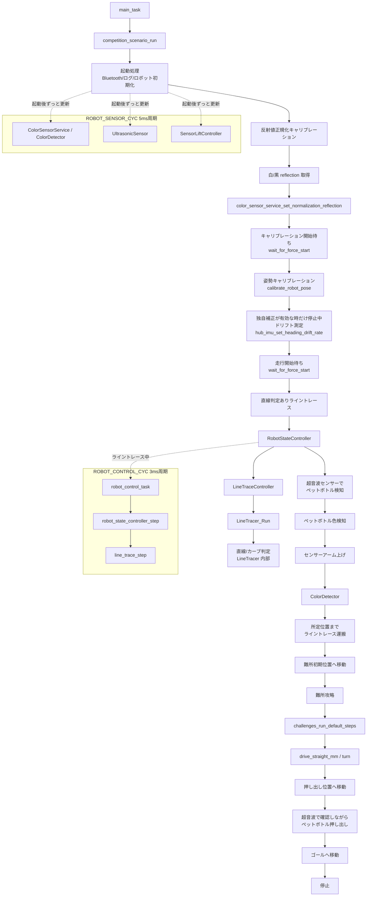

# etrobo_app_0 Function Specification

このファイルは `workspace/etrobo_app_0` の関数仕様書です。
関数の処理内容だけでなく、ファイル間の連携、計算式、使い方、ログで見る意味、調整値の意味までここにまとめます。

## 読み方

- `static` 関数、`namespace {}` 内の関数は、その `.cpp` ファイル内だけで使う内部関数です。
- 単位は、距離が `mm`、モーター角度が `deg`、モーター速度が `deg/s`、モーターパワーが `-100` から `100`、待ち時間が `us` です。
- `heading` は Hub IMU の方位角です。右旋回が正、左旋回が負として扱います。
- `reflection` はカラーセンサーの反射値の生値、`normalized_reflection` は白黒キャリブレーション後の `0..100` 正規化値です。
- `line trace` はパワー制御、距離走行/旋回は主に速度制御です。

## 全体構成

| フォルダー | 役割 |
| --- | --- |
| `config/` | ポート、車体寸法、PIDゲイン、色判定しきい値、ライントレース、ボトル、難所などの設定。`RobotConfig.h` は互換用入口。 |
| `scenario/` | 競技全体の流れを管理する。起動、フォース待ち、姿勢キャリブレーション、区間関数の呼び出し、失敗表示を担当する。 |
| `sections/` | 競技の各区間を置く。ボトル検知ライントレース、ボトル色検知/運搬、難所走行、押し出し、ゴール走行を分けて管理する。 |
| `challenges/` | 難所攻略ロジック置き場。現在は `F/B/L/R` のステップ文字列を読んで走行する。 |
| `drive/` | 左右走行モーターの共通処理、距離走行、加減速、IMU旋回、直進PID。 |
| `bottle_detection/` | 超音波センサーでボトルを探索し、検出座標へIMU閉ループで接近する。 |
| `LineTracer/` | カラーセンサー反射値を使ったライントレース本体と、距離指定で呼ぶ窓口。 |
| `control/` | 起動、ロボット初期化、状態管理、周期タスク制御、センサー昇降。 |
| `sensors/` | カラー、色判定、フォース、IMU、超音波、全センサー一括取得。 |
| `logging/` | Bluetooth送信とCSVログ。通常センサー行、ライントレース、直進PID、旋回、難所コマンド境界のデバッグを出す。 |
| `HubIMU/` | SPIKE-RT/pybricks IMU APIの薄いラッパー。 |
| `app.cpp` | TOPPERSタスク入口と、残してある直進/旋回テスト関数を置く。競技本番の流れは `scenario/CompetitionScenario.cpp` に渡す。 |

## メイン競技フロー

`main_task()` は本番処理を直接持たず、`ChallengeConfig.h` の `RUN_CHALLENGE_ONLY_TEST` で入口を切り替えます。
`RUN_CHALLENGE_ONLY_TEST = true` なら `competition_scenario_run_challenge_test()`、`false` なら `competition_scenario_run()` を呼びます。
競技のメイン手順は `scenario/CompetitionScenario.cpp` が順番を決め、実際の走行や検知は `sections/` と下位モジュールへ委譲します。

現在の競技フローは次の順番です。

1. メイン開始。
2. Bluetoothログ接続待ち。
3. 白/黒の反射値をフォースセンサー操作で取得し、反射値を `0..100` へ正規化する。
4. フォースセンサーでキャリブレーション開始待ち。
5. 姿勢キャリブレーション後、SPIKE側の3D headingを走行基準にする。`ENABLE_CUSTOM_HEADING_DRIFT_CORRECTION = true` の比較条件では、停止したまま約10秒headingの流れを測って独自補正へ組み込む。
6. フォースセンサーで走行開始待ち。
7. センサーアームを下ろしながらPID直進し、下降完了後に直線/カーブ判定ありライントレースへ切り替える。
8. ライントレース開始5秒後に超音波センサーを有効化し、15cm以内のペットボトルを検知したら停止する。
9. PID制御で徐行直進し、カラーセンサーを上げてペットボトル色を検知する。
10. カラーセンサーを下げ、ライントレースしながら青ゾーン数と黒検知で搬送先を決める。
11. 姿勢キャリブレーション後、難所をPID直進とIMU旋回で攻略する。
12. 難所ゴール時点のheadingを表示する。
13. 押し出し位置へ移動し、超音波センサーで確認しながらペットボトルを押し出す。
14. ゴールへ移動して停止する。



押し出し位置への移動距離とゴール移動距離は `BottleConfig.h` の設定値で詰めます。初期値は安全側で0なので、実機の位置合わせ後に距離を入れます。

### 難所だけテストフロー

`ChallengeConfig.h` の `RUN_CHALLENGE_ONLY_TEST = true` の時は、起動後に難所だけをテストします。
白黒反射値キャリブレーション、ボトル区間、押し出し、ゴール走行は実行しません。

1. Bluetoothログ接続待ち。
2. フォースセンサーでキャリブレーション開始待ち。
3. 姿勢キャリブレーション。独自ドリフト補正が有効な時だけ停止中測定も行う。
4. フォースセンサーで難所走行開始待ち。
5. `run_challenge_section()` で既定の難所ステップを実行。
6. 難所終了時のheadingを `H+0.0` のように表示。
7. `E` を表示し、次のフォース操作で同じ難所テストをもう一度実行できる。

## 主要な呼び方

| やりたいこと | 呼び方 | 補足 |
| --- | --- | --- |
| 正確な直進を距離指定で走る | `drive_straight_mm(speed, distance_mm)` | IMU直進PIDで `reset_straight_pid_heading()` の目標方位を保つ。最後はブレーキする。 |
| 加速、定速、減速をつなぐ | `speed_up(a,b,mm); drive_straight_mm_keep_speed(b,mm); speed_down(b,0,mm);` | `keep_speed` は最後にブレーキしない。減速の `end_speed == 0` で止まる。 |
| 右90度旋回 | `turn(speed, 90)` | 正の角度は右、負の角度は左。成功後は次の直進PID目標を旋回後headingに合わせる。 |
| 左90度旋回 | `turn(speed, -90)` | 内部では `TurnDirection::Left`、`direction_sign = -1`。 |
| エンコーダ主制御で旋回 | `turn_by_encoder(speed, degrees)` | 難所の現在モード。左右エンコーダで終了し、減速後にcoastしてからブレーキする。 |
| 絶対方位へ旋回 | `turn_to_heading(speed, target_heading)` | 現在headingから目標headingへの最短方向で旋回する。難所では設定をfalseにした比較モードで使用する。 |
| ライントレースを1周期進める | `line_trace_step()` | 周期タスクから呼ぶ。内部で `LineTracer_Run()` を1回実行。 |
| ライントレースを距離で止める | `run_line_trace_mm(distance_mm)` | エンコーダ距離で終了。`LineTracer_Run()` を使う形で距離走行を統一している。 |
| 状態管理つきでライントレースする | `robot_state_controller_run_line_trace(&options)` | `options.distance_mm` で距離停止、`options.ultrasonic_start_delay_us` で超音波ONタイミングを指定する。 |
| 白黒反射値を使って正規化範囲を設定する | `color_sensor_service_set_normalization_reflection(black, white)` | 黒反射値と白反射値を渡し、`normalized_reflection` の0..100換算に使う。 |
| `F/B/L/R`文字列どおりに走る | `challenges_run_steps("FFBBRR")` | 文字列全体を事前検証し、開始時の現在方位を直進基準に設定してから、連続した同じ文字をまとめて走る/回る。 |
| 既定の難所ステップを走る | `challenges_run_default_steps()` | 長い文字列を使わず、`challenges.cpp` 内の事前圧縮した型付きコマンド表を直接実行する。 |
| ボトルを探索して接近する | `bottle_detection_run()` | 走行開始時の正面を0度とし、-90度から+90度まで超音波で探索する。 |
| カラーセンサーを上げる/下げる | `sensor_lift_start_up()` / `sensor_lift_start_down()` | 開始後は `sensor_lift_step()` を周期的に呼んで完了させる。 |

## app.h

### 定義

| 名前 | 意味 |
| --- | --- |
| `MAIN_PRIORITY` | メインタスクの優先度。 |
| `ROBOT_CONTROL_PRIORITY` | ライントレース制御周期タスクの優先度。 |
| `ROBOT_SENSOR_PRIORITY` | 色判定、超音波、センサー昇降などの周期タスク優先度。 |
| `BLUETOOTH_CONNECTION_PRIORITY` | Bluetooth接続タスクの優先度。 |
| `SENSOR_LOG_PRIORITY` | CSVログ送信タスクの優先度。 |
| `ROBOT_CONTROL_PERIOD` | `ROBOT_CONTROL_CYC` の周期。3ms。ライントレースの制御周期。 |
| `ROBOT_SENSOR_PERIOD` | `ROBOT_SENSOR_CYC` の周期。5ms。センサー系サービス更新周期。 |
| `STACK_SIZE` | 各タスクのスタックサイズ。未定義なら4096。 |

### 宣言

| 関数 | 呼ばれ方 | 役割 |
| --- | --- | --- |
| `sensor_log_task(intptr_t unused)` | `SENSOR_LOG_TASK` | Bluetoothが準備できていればCSVログを周期送信する。 |
| `robot_control_task(intptr_t unused)` | `ROBOT_CONTROL_CYC` | `robot_state_controller_step()` を1回呼ぶ。 |
| `robot_sensor_task(intptr_t unused)` | `ROBOT_SENSOR_CYC` | `robot_sensor_services_step()` を1回呼ぶ。 |
| `main_task(intptr_t exinf)` | `MAIN_TASK` | アプリ全体の入口。 |

## app.cpp

TOPPERSから直接呼ばれるタスク入口と、残してある直進/旋回テスト関数を置くファイルです。
競技本番の流れは `competition_scenario_run()` に委譲します。

### 内部状態

| 名前 | 意味 |
| --- | --- |
| `test_failure_step` | テスト関数用。失敗した手順を1文字で保存する。 |
| `test_failure_reason` | テスト関数用。失敗理由を1文字で保存する。 |
| `TEST_STRAIGHT_*` | `runProfiledStraight()` 用のテスト走行速度と距離。加速150mm、定速200mm、減速150mm。 |
| `TEST_TURN_SPEED_DEG_S` | `runRightAngleTurnTest()` で使う90度旋回速度。160deg/s。 |

### テスト用の失敗表示と結果変換

| 関数 | 処理 | 返り値/意味 |
| --- | --- | --- |
| `testDriveFailureReason(result)` | 直進/距離走行の結果をHub表示文字へ変換する。 | `T`=timeout、`M`=motor、`O`=OK。 |
| `testTurnFailureReason(result)` | 旋回結果をHub表示文字へ変換する。 | `E`=encoder limit、`T`=timeout、`M`=motor、`O`=OK。 |
| `rememberTestFailure(step, reason)` | `test_failure_step` と `test_failure_reason` を更新する。 | `showTestFailureLoop()` で使う。 |
| `showTestFailureLoop()` | Hubに失敗ステップと理由を800msごとに交互表示して無限停止する。 | テスト関数へ切り替えた時用。通常の競技失敗表示は `CompetitionScenario.cpp` 側。 |
| `showTestDriveResult(step, result)` | 距離走行結果がOKなら `true`、失敗なら表示情報を保存して `false`。 | テスト用の `runProfiledStraight()` で使う。 |
| `showTestTurnResult(step, result)` | 旋回結果がOKなら `true`、失敗なら表示情報を保存して `false`。 | テスト用の `runRightAngleTurnTest()` で使う。 |

### 走行シナリオ

| 関数 | 処理 | 使い方 |
| --- | --- | --- |
| `runProfiledStraight()` | `speed_up(200, 800, 150)`、`drive_straight_mm_keep_speed(800, 200)`、`speed_down(800, 0, 150)` を順に呼ぶ。 | 現在のメイン経路では未使用。直進加減速テストへ戻す時に使う。 |
| `runRightAngleTurnTest()` | `turn(160, 90)` を呼び、結果を `showTestTurnResult('R', ...)` で表示用に変換する。 | 現在のメイン経路では未使用。90度旋回テストへ戻す時に使う。 |

### タスク

| 関数 | 処理 | 注意 |
| --- | --- | --- |
| `robot_control_task(unused)` | `robot_state_controller_step()` を1回実行して `ext_tsk()`。 | 周期ハンドラから起動される短命タスク。 |
| `robot_sensor_task(unused)` | `robot_sensor_services_step()` を1回実行して `ext_tsk()`。 | 色判定/超音波/昇降更新。 |
| `sensor_log_task(unused)` | Bluetooth readyならヘッダー送信後、`sensor_csv_logger_print_row()` を `SENSOR_CSV_LOG_INTERVAL_US` 周期で送る。切断時はヘッダー送信状態をリセット。 | ログの `ms` は送信側の経過カウンタ。 |
| `main_task(unused)` | `RUN_CHALLENGE_ONLY_TEST` を見て、`competition_scenario_run_challenge_test()` または `competition_scenario_run()` を呼ぶ。 | 起動時の実行モード切り替え入口。 |

## scenario/CompetitionScenario.h / CompetitionScenario.cpp

競技全体の状態遷移を置くファイルです。
走行の細かい処理は `sections/` に分け、ここでは起動、Bluetooth/ログ開始、ロボット初期化、フォース待ち、姿勢キャリブレーション、区間の順番、失敗表示を担当します。

### 状態

| 状態 | 意味 |
| --- | --- |
| `COMPETITION_SCENARIO_STATE_START` | 競技シナリオ開始直後。 |
| `COMPETITION_SCENARIO_STATE_WAIT_FOR_START` | フォースセンサーでスタート待ち。 |
| `COMPETITION_SCENARIO_STATE_CALIBRATE_POSE` | IMU取り付け角/heading/エンコーダを走行前に合わせる。 |
| `COMPETITION_SCENARIO_STATE_LINE_TRACE_TO_BOTTLE` | ライントレースしながら超音波でペットボトル検知へ向かう。 |
| `COMPETITION_SCENARIO_STATE_DETECT_COLOR` | カラーセンサーでボトル色を判定する。 |
| `COMPETITION_SCENARIO_STATE_LOWER_ARM` | アーム/センサーを下げる。 |
| `COMPETITION_SCENARIO_STATE_LINE_TRACE_AFTER_BOTTLE` | アーム下降後、距離指定でライントレースを再開する。 |
| `COMPETITION_SCENARIO_STATE_CHALLENGE_LAPS` | 難所をPID直進と旋回で周回する。現在の主処理。 |
| `COMPETITION_SCENARIO_STATE_PUSH_BOTTLE` | ペットボトル押し出し。 |
| `COMPETITION_SCENARIO_STATE_GOAL_RUN` | ゴールへ向かう。 |
| `COMPETITION_SCENARIO_STATE_FINISHED` | 1回の走行シナリオ完了。 |
| `COMPETITION_SCENARIO_STATE_FAILED` | 失敗表示ループへ入る状態。 |

### 内部状態/関数

| 名前 | 処理 | 意味 |
| --- | --- | --- |
| `current_state` | 現在の競技状態。 | `competition_scenario_get_state()` で読める。 |
| `failure_step`, `failure_reason` | Hub失敗表示用の1文字。 | 失敗時に交互表示する。 |
| `setScenarioState(state)` | CPUロック中に `current_state` を更新する。 | ログ/別タスクから読む時の競合を避ける。 |
| `robotInitFailureReason(result)` | 初期化結果を表示文字へ変換する。 | `D`=device、`M`=motor、`I`=IMU。 |
| `rememberFailure(step, reason)` | 失敗表示文字を保存し、状態を `FAILED` にする。 | `showFailureLoop()` の前に呼ぶ。 |
| `showFailureLoop()` | 失敗ステップと理由を800msごとにHub表示する。 | 戻らない。 |
| `showSectionResult(result)` | 区間結果がOKなら `true`、失敗なら表示文字を保存して `false`。 | `sections/` から返る共通結果を受ける。 |
| `startBackgroundTasks()` | Bluetooth送信初期化、Bluetoothタスク、ログタスクを起動する。 | `competition_scenario_run()` の最初に呼ぶ。 |
| `initializeRobot()` | Hubに `I` を表示し、`initialize_robot()` を呼ぶ。 | 失敗時は `rememberFailure('I', reason)`。 |
| `waitForBluetoothLog()` | 設定が有効ならBluetooth readyを待つ。 | 未接続=`B`、接続済み準備中=`b`、ready=`A`。 |
| `sampleReflection(display_char)` | `W` または `K` を表示し、フォース操作後に反射値を複数回サンプルして平均する。 | 白/黒正規化キャリブレーション用。 |
| `calibrateColorReflection()` | 白反射値、黒反射値を取得し、`color_sensor_service_set_normalization_reflection()` へ渡す。 | 成功時は `N` 表示。失敗時は `W/C`, `K/C`, `N/R`。 |
| `calibrateRobotPoseAndDrift()` | 姿勢キャリブレーション後、`ENABLE_CUSTOM_HEADING_DRIFT_CORRECTION` が有効な時だけraw headingを約10秒測り、1分あたりのドリフト量を設定する。 | 現在の既定値は無効。独自補正と10秒待機を省き、SPIKE側の3D headingをそのまま制御基準にする。表示は `D+0.0`。 |
| `runBottleColorCheckpoint()` | `run_line_trace_to_bottle_section()` と `run_bottle_color_carry_section()` を順に実行する。 | ボトル前後の主まとまり。 |
| `runCurrentChallengeLap()` | Bluetooth待ち、反射値正規化、フォース待ち、姿勢/ドリフトキャリブレーション、フォース待ち、ボトル区間、難所、heading表示、押し出し、ゴールを1回実行する。 | 現在の主シナリオ。成功時は `E` 表示。 |
| `runChallengeOnlyTestLap()` | Bluetooth待ち、フォース待ち、姿勢/ドリフトキャリブレーション、フォース待ち、難所、heading表示だけを1回実行する。 | 難所だけのテスト用。成功時は `E` 表示。 |

### 公開関数

| 関数 | 処理 | 使い方 |
| --- | --- | --- |
| `competition_scenario_run()` | 起動処理後、`runCurrentChallengeLap()` を無限に繰り返す。 | `main_task()` から呼ぶ。戻らない前提。 |
| `competition_scenario_run_challenge_test()` | 起動処理後、`runChallengeOnlyTestLap()` を無限に繰り返す。 | `RUN_CHALLENGE_ONLY_TEST = true` の時に `main_task()` から呼ぶ。 |
| `competition_scenario_set_state(state)` | 現在の競技状態を更新する。 | `sections/` 側が自分の区間状態をログへ反映する時に呼ぶ。 |
| `competition_scenario_get_state()` | 現在の状態を返す。 | ログやデバッグ表示へ使える。 |

## sections/

競技区間ごとの専用処理を置くフォルダーです。現在はファイル数を減らすため、区間処理を `CompetitionSections.cpp/h` に集約しています。
`CompetitionScenario.cpp` が順番だけを決め、各区間の中身はここで閉じます。

### CompetitionSections.h

| 名前 | 処理 | 意味 |
| --- | --- | --- |
| `competition_section_result_t` | 区間の成功/失敗、失敗ステップ、失敗理由をまとめて返す構造体。 | `ok=false` の時、Hubに `step` と `reason` が交互表示される。 |
| `competition_section_ok()` | 成功結果を作る。 | `ok=true`, `step='O'`, `reason='O'`。 |
| `competition_section_fail(step, reason)` | 失敗結果を作る。 | どの区間で何が原因かを呼び出し元へ返す。 |
| `run_line_trace_to_bottle_section()` | ボトル検知までのライントレース区間を実行する。 | `CompetitionScenario.cpp` から呼ぶ。 |
| `run_bottle_color_carry_section()` | ボトル色検知と色別搬送区間を実行する。 | `CompetitionScenario.cpp` から呼ぶ。 |
| `bottle_color_carry_section_get_color()` | 最後に検出したボトル色を返す。 | 後続区間で色分岐が必要になった時用。 |
| `run_challenge_section()` | 難所攻略区間を実行する。 | 難所単体テストでも使う。 |
| `run_bottle_push_section()` | ボトル押し出し区間を実行する。 | 超音波で押し出し完了を判定する。 |
| `run_goal_section()` | ゴールへ向かう区間を実行する。 | 最後に停止する。 |

### CompetitionSections.cpp

| 関数 | 処理 | 意味 |
| --- | --- | --- |
| `sectionDriveFailureReason(result)` | 直進/距離走行の結果をHub表示文字へ変換する。 | `T`=timeout、`M`=motor、`O`=OK。 |
| `sectionLineTraceFailureReason(result)` | ライントレース結果をHub表示文字へ変換する。 | `T`=timeout、`D`=device、`O`=OK。 |
| `sectionChallengeFailureReason(result)` | 難所ステップ結果をHub表示文字へ変換する。 | `S`=不正ステップ、`D`=直進失敗、`T`=旋回失敗、`E`=空、`N`=null。 |
| `wasBottleDetectedByUltrasonic()` | 最新の超音波状態が enabled/ready/obstacle すべてtrueなら `true`。 | ライントレース停止理由がボトル検知だったか確認する。 |
| `lowerSensorArmWhileDrivingStraight()` | Hubに `D` を表示し、センサーアーム下降を開始する。下降完了までは `drive_straight_mm_keep_speed()` を短距離ずつ繰り返してIMU直進PIDで進む。 | 下降失敗なら `D/M`、最大距離超過なら `D/T`。 |
| `run_line_trace_to_bottle_section()` | 最初にアーム下降中のPID直進を行い、その後状態を `LINE_TRACE_TO_BOTTLE` にして、距離無制限、`LINE_TRACE_TO_BOTTLE_ULTRASONIC_START_DELAY_US` 後に超音波ONでライントレースする。 | 検知できたら `U` 表示。検知なし終了なら `U/N` 失敗。 |
| `colorDisplayChar(color)` | 判定色をHub表示文字へ変換する。 | 赤=`R`、青=`B`、黄=`Y`、緑=`G`、灰=`A`、白=`W`、黒=`K`。 |
| `waitForSensorLift(step)` | センサー昇降がbusyでなくなるまで `ROBOT_SENSOR_PERIOD` 周期で待つ。 | エラーなら `step/M` を返す。 |
| `moveSensorArm(step, up)` | `up=true` なら上げ、falseなら下げを開始して完了待ちする。 | 上げ=`A`、下げ=`D` で呼ぶ。 |
| `sampleBottleColor()` | `BOTTLE_COLOR_SAMPLE_COUNT` 回だけ色判定状態を読み、多数決で色を返す。 | unknown以外の最多色を採用する。 |
| `detectBottleColor()` | 状態を `DETECT_COLOR` にし、ボトル色をサンプルしてHubへ色文字を表示する。 | unknownなら `C/U` 失敗。 |
| `approachBottleForColor()` | 現在headingを直進PID目標にリセットし、低速で `BOTTLE_COLOR_APPROACH_DISTANCE_MM` だけ進む。 | 超音波停止後、色検知位置へ近づく。 |
| `requiredBlueZoneCount(color)` | ペットボトル色から通過すべき青ゾーン数を返す。 | 黄=1、青=2、赤=3。それ以外は失敗扱い。 |
| `runColorAwareLineTraceToBlack()` | RGB色判定を有効にしたままライントレースし、必要な青ゾーン数を通過後に黒を検知したら停止する。 | 黄/青/赤の搬送先分岐に使う。 |
| `turnByDegrees(step, degrees)` | `turn(CHALLENGE_STEP_TURN_SPEED_DEG_S, degrees)` を呼ぶ。 | 正の角度が右、負の角度が左。 |
| `driveUntilColor(step, target_color, travelled_mm)` | PID直進を短距離ずつ行い、目標色を検知したら進んだ距離を返す。 | 色と同じゾーンまで進む。見つからない場合は `step/C`。 |
| `driveBackTravelledDistance(distance_mm)` | 検知位置まで進んだ距離だけPIDで後退する。 | 右90度後に戻る処理。 |
| `driveUntilBottomBlueThenBlack()` | 一番下の青ゾーンを通過し、その後の黒を検知するまでPID直進する。 | 見つからない場合は `N/T`。 |
| `run_bottle_color_carry_section()` | 低速直進、アーム上げ、色判定、アーム下げ、青ゾーン数つきライントレース、姿勢キャリブレーション、右90度、色ゾーン検知、右90度、後退、右90度、下側青通過後黒検知、左90度を順に実行する。 | ボトル検知後の専用区間。 |
| `bottle_color_carry_section_get_color()` | 最後に検出したボトル色を返す。 | 押し出し位置分岐などの後続処理で使う想定。 |
| `run_challenge_section()` | 状態を `CHALLENGE_LAPS` にし、`challenges_run_default_steps()` を実行する。 | 難所攻略専用区間。 |
| `driveForward(step, speed_deg_s, distance_mm)` | 押し出し位置へ向けた事前直進を行う。距離0なら何もしない。 | `BOTTLE_PUSH_APPROACH_DISTANCE_MM` で調整する。 |
| `waitForUltrasonicUpdate()` | 超音波センサーON後、センサー周期を数回待って最新値を作る。 | 古い距離値で判定しないため。 |
| `run_bottle_push_section()` | 押し出し位置へ移動し、超音波でボトルを確認しながら短距離PID直進を繰り返す。ボトルを一度見てから見失ったら押し出し完了とみなす。 | 検知できない場合は `O/N`。 |
| `run_goal_section()` | 必要なら旋回し、設定距離だけPID直進して停止する。 | `GOAL_RUN_TURN_DEGREES`、`GOAL_RUN_DISTANCE_MM`、`GOAL_RUN_SPEED_DEG_S` で調整する。 |

## config/

config配下は関数ではなく、ほぼ全モジュールが参照する設定を置く場所です。
既存コードとの互換のため `RobotConfig.h` は残し、各設定ファイルをまとめてincludeする入口にしています。
色判定レンジのように型へ依存する定数と、`DriveMotors` / `TurnDirection` は `RobotConfig.h` に残しています。

| ファイル | 置くもの |
| --- | --- |
| `HardwareConfig.h` | モーター/センサーのポート、車輪径、トレッド、円周率などの車体寸法。 |
| `ControlConfig.h` | 制御周期、IMU/モーター準備、直進PID、旋回PID、安全停止、停止後settle。 |
| `SensorConfig.h` | カラーセンサー正規化値、反射値サンプル、カラーセンサー昇降モーター設定。 |
| `LogConfig.h` | Bluetoothログ待ち、CSVログ周期。 |
| `ChallengeConfig.h` | 難所だけテスト切り替え、難所ステップ距離/速度、S字/8の字テスト設定。 |
| `BottleConfig.h` | 超音波ON/OFF、ボトル検知/色判定/搬送/押し出し/ゴール移動の距離と速度。 |
| `LineTraceConfig.h` | `LineTracer` の `#define` 調整値。直線/カーブ判定、power、IMU補正、エッジ設定。 |
| `RobotConfig.h` | 上記configの入口。型依存の色判定レンジと共通型もここに残す。 |

### ポート

| 定義 | 意味 |
| --- | --- |
| `LEFT_MOTOR_PORT = B` | 左走行モーター。 |
| `RIGHT_MOTOR_PORT = A` | 右走行モーター。 |
| `COLOR_SENSOR_PORT = E` | ライントレース/色判定用カラーセンサー。 |
| `COLOR_SENSOR_LIFT_MOTOR_PORT = C` | カラーセンサー昇降モーター。 |
| `FORCE_SENSOR_PORT = D` | スタート用フォースセンサー。 |
| `ULTRASONIC_SENSOR_PORT = F` | 超音波センサー。ライントレース中のボトル検知、周期ログ、`BottleDetection` がこのポートを読む。 |

### 基本周期と安全停止

| 定義 | 意味 |
| --- | --- |
| `CONTROL_PERIOD_US = 10000` | 距離走行/旋回などの通常制御周期。10ms。 |
| `CONTROL_PERIOD_SEC = 0.01` | PID微分/積分計算用の秒単位周期。 |
| `CALIBRATION_SAMPLES = 100` | IMU取り付け角の平均サンプル数。 |
| `ENABLE_CUSTOM_HEADING_DRIFT_CORRECTION = false` | アプリ独自の時間比例heading補正を使うか。現在はSPIKE側headingとのA/B確認のため無効。 |
| `IMU_DRIFT_CALIBRATION_TIME_US = 10000000` | 独自補正が有効な場合に、停止したままheadingドリフトを測る時間。10秒。 |
| `IMU_READY_RETRIES = 100` | IMU準備待ち回数。1回100msなので最大約10秒。 |
| `MOTOR_SETUP_RETRIES = 50` | モーターsetupリトライ回数。1回10msなので最大約0.5秒。 |
| `MAX_CONTROL_CYCLES = 3000` | 汎用制御ループの安全停止用。 |
| `MAX_DRIVE_CYCLES = 10000` | 距離走行/ライントレース距離指定の安全停止用。 |
| `TURN_TIMEOUT_CYCLES = 800` | 通常旋回の最大周期。10ms制御なら最大約8秒。 |
| `RUN_CHALLENGE_ONLY_TEST = true` | 起動後に難所だけテストを実行する。通常の競技フローへ戻す時は `false` にする。 |

### 車体寸法と換算

| 定義 | 意味 |
| --- | --- |
| `PI` | 円周率。 |
| `GRAVITY_MM_S2` | 重力加速度。 |
| `WHEEL_DIAMETER_MM = 56.0` | 車輪直径。 |
| `TREAD_MM = 150.0` | 左右車輪間隔。 |

距離換算は `DriveBase.cpp` で次の式を使います。

```text
mm = encoder_degrees * PI * WHEEL_DIAMETER_MM / 360
encoder_degrees = mm * 360 / (PI * WHEEL_DIAMETER_MM)
```

旋回時の車輪側エンコーダ概算は次です。

```text
wheel_encoder_degrees_for_turn = abs(robot_degrees) * TREAD_MM / WHEEL_DIAMETER_MM
encoder_limit = wheel_encoder_degrees_for_turn * ENCODER_LIMIT_MARGIN + ENCODER_LIMIT_EXTRA_DEG
```

### 距離走行

| 定義 | 意味 |
| --- | --- |
| `MOTOR_SPEED_LIMIT_DEG_S = 1000` | SPIKE-RT速度制御へ渡す速度の上限。 |
| `MIN_STRAIGHT_SPEED_DEG_S = 120` | 加減速中に0付近で止まらないための最低直進速度。 |
| `STRAIGHT_PID_KP = 12.0` | 直進方位誤差の比例ゲイン。大きいほど向きを戻す力が強い。 |
| `STRAIGHT_PID_KI = 0.0` | 直進方位誤差の積分ゲイン。現状は累積補正を使わない。 |
| `STRAIGHT_PID_KD = 1.5` | 直進方位誤差の微分ゲイン。向きの変化へ反応する。 |
| `STRAIGHT_PID_DEADBAND_DEG = 0.15` | この角度以下の方位誤差を0扱いし、小刻みな頭振りを抑える。 |
| `STRAIGHT_START_SPEED_LIMIT_CYCLES = 20` | 旋回後の直進開始直後だけ速度制限する周期数。 |
| `STRAIGHT_START_SPEED_LIMIT_DEG_S = 180` | 直進開始直後の速度上限。 |
| `STRAIGHT_PID_CORRECTION_RAMP_CYCLES = 35` | 直進開始直後のPID補正上限をなだらかに増やす周期数。 |
| `STRAIGHT_START_CORRECTION_LIMIT_DEG_S = 60.0` | 直進開始直後のPID補正上限。 |
| `STRAIGHT_PID_INTEGRAL_LIMIT_DEG_SEC = 20.0` | KIを使う場合の積分項上限。 |
| `STRAIGHT_PID_CORRECTION_LIMIT_DEG_S = 240.0` | 直進PIDの左右速度差補正上限。 |

### 旋回

| 定義 | 意味 |
| --- | --- |
| `MIN_TURN_SPEED_DEG_S = 40` | 通常旋回で最低限動かす速度。 |
| `TURN_APPROACH_TOLERANCE_DEG = 1.0` | 通常旋回を終える許容角。微小な往復旋回を避ける。 |
| `TURN_APPROACH_STABLE_COUNT = 3` | 通常旋回で許容角に連続して入る必要回数。 |
| `LEFT_TURN_PRE_BRAKE_DEG = 0.0` | 左主旋回を理想角より手前で止める量。左の行き過ぎは未確認なので現在は無効。 |
| `RIGHT_TURN_PRE_BRAKE_DEG = 7.0` | ジャイロ旋回時、右主旋回を理想角より7度手前でブレーキする。難所のエンコーダ主制御モードでは使わない。 |
| `GYRO_TOLERANCE_DEG = 1.5` | 停止後補正が目標へ到達したとみなす角度誤差。 |
| `TURN_SETTLED_ACCEPTANCE_TOLERANCE_DEG = 3.0` | 通常旋回後に再旋回せず走行を続けられる誤差。残差は方位格子へ累積せず、次の直進PIDで戻す。 |
| `TURN_STABLE_COUNT = 1` | 精密補正では許容角に入ったら即停止する。 |
| `TURN_SETTLED_CORRECTION_CYCLES = 100` | 停止後補正1回の最大周期。10ms制御で最大約1秒。 |
| `TURN_SETTLED_CORRECTION_SPEED_DEG_S = 50` | 精密補正の速度上限。 |
| `TURN_SETTLED_CORRECTION_ATTEMPTS = 1` | 静止摩擦とバックラッシュによる往復を避けるため、停止後補正は最大1回。 |
| `TURN_FINE_CORRECTION_MIN_SPEED_DEG_S = 50` | 精密補正時の最低速度。 |
| `TURN_FINE_CORRECTION_PULSE_WINDOW_DEG = 0.5` | この角度以内では1パルスごとに止めてIMUを再測定する。 |
| `TURN_FINE_COAST_BRAKE_WINDOW_DEG = 3.0` | 精密補正中、この角度以内で勢いが残っていれば早めにブレーキする。 |
| `TURN_FINE_COAST_BRAKE_YAW_RATE_DEG_S = 5.0` | 早めブレーキ判定に使うZ角速度の下限。 |
| `TURN_FINE_CORRECTION_SETTLE_TIME_US = 60000` | 精密補正でブレーキ後にIMU値を落ち着かせる待ち時間。 |
| `DRIVE_STOP_SETTLE_TIME_US = 100000` | 直進/旋回後のブレーキ安定待ち。 |
| `ENCODER_LIMIT_MARGIN = 1.35` | 旋回時のエンコーダ安全上限倍率。 |
| `ENCODER_LIMIT_EXTRA_DEG = 30.0` | エンコーダ安全上限に足す余裕。 |
| `LEFT_TURN_ANGLE_SCALE = 1.0` | 左旋回角度倍率。 |
| `RIGHT_TURN_ANGLE_SCALE = 1.0` | 右旋回角度倍率。 |
| `TURN_ANGLE_OFFSET_DEG = 0.0` | 旋回角度に一律で足すオフセット。 |
| `TURN_PID_KP = 8.0` | 旋回PIDの比例ゲイン。 |
| `TURN_PID_KI = 0.0` | 旋回PIDの積分ゲイン。現状は使わない。 |
| `TURN_PID_KD = 0.35` | 旋回PIDの微分ゲイン。 |
| `TURN_PID_INTEGRAL_LIMIT_DEG_SEC = 20.0` | 旋回PID積分項上限。 |

### 色/正規化/マーク判定

| 定義 | 意味 |
| --- | --- |
| `COLOR_SENSOR_DEFAULT_NORMALIZE_BLACK_REFLECTION = 10` | 白黒キャリブレーション前の黒基準。 |
| `COLOR_SENSOR_DEFAULT_NORMALIZE_WHITE_REFLECTION = 80` | 白黒キャリブレーション前の白基準。 |
| `COLOR_SENSOR_NORMALIZED_TARGET_REFLECTION = 50` | 正規化後のライン境界目標。黒0、白100の中央。 |
| `COLOR_SENSOR_CALIBRATION_RANGES` | 試走ログから作った色別範囲表。反射値、RGB、HSVを黒/緑/黄/赤/青/白ごとに持つ。 |
| `COLOR_BLACK_RANGE` など | `COLOR_SENSOR_CALIBRATION_RANGES` から色ごとに取り出した使いやすい名前。 |
| `GRAY_MARK_*` | 灰色判定。反射値、低彩度、明度で判定する。 |
| `RED_MARK_*` | 赤判定。RGB範囲と `R-G`、`R-B` の差で判定する。 |
| `BLUE_MARK_*` | 青判定。RGB範囲と `B-R`、`B-G` の差で判定する。 |
| `YELLOW_MARK_*` | 黄判定。RGB範囲、`R/G - B`、`R-G` バランスで判定する。 |
| `WHITE_MARK_*` | 白判定。正規化反射値、低彩度、明度で判定する。 |
| `BLACK_MARK_*` | 黒判定。正規化反射値、明度で判定する。 |

### センサー昇降、ライントレース距離、ログ、超音波

| 定義 | 意味 |
| --- | --- |
| `COLOR_SENSOR_LIFT_MOTOR_DIRECTION` | 昇降モーターの正転方向。 |
| `COLOR_SENSOR_LIFT_SPEED_DEG_S = 900` | 昇降モーター速度。 |
| `COLOR_SENSOR_LIFT_UP_DEGREES = 220` | 上げる時の移動角。 |
| `COLOR_SENSOR_LIFT_DOWN_DEGREES = 220` | 下げる時の移動角。 |
| `COLOR_SENSOR_LIFT_TIMEOUT_CYCLES = 100` | 昇降の安全停止周期。5ms周期なら約0.5秒。 |
| `WAIT_FOR_BLUETOOTH_LOG = true` | 起動後にBluetoothログ接続を待つ。 |
| `SENSOR_CSV_LOG_INTERVAL_US = 100000` | CSVログ周期。100ms。Bluetooth送信が詰まってログが止まりにくい周期にしている。 |
| `ENABLE_ULTRASONIC_SENSOR = true` | 超音波センサーを使うか。falseならライントレース中の遅延ONも無効。 |
| `ENABLE_ULTRASONIC_STOP = true` | 障害物停止を使うか。 |
| `LINE_TRACE_TO_BOTTLE_ULTRASONIC_START_DELAY_US = 5000000` | ボトル検知用ライントレースで、開始から超音波検知を有効にするまでの待ち時間。5秒。 |
| `LINE_TRACE_TO_BOTTLE_ARM_LOWER_SPEED_DEG_S = 120` | ボトル検知ライントレース開始前、センサーアームを下げながら直進する速度。 |
| `LINE_TRACE_TO_BOTTLE_ARM_LOWER_STEP_MM = 5` | アーム下降中に1回のPID直進で進む距離。小さいほど完了時の余走が少ない。 |
| `LINE_TRACE_TO_BOTTLE_ARM_LOWER_MAX_DISTANCE_MM = 80` | アーム下降待ちで直進してよい最大距離。超えると `D/T` 失敗。 |
| `ULTRASONIC_OBSTACLE_DISTANCE_MM = 150` | 障害物ありとみなす距離。15cm以内で検知。 |
| `BOTTLE_COLOR_APPROACH_SPEED_DEG_S = 120` | ボトル色検知位置へ近づく低速PID直進の速度。 |
| `BOTTLE_COLOR_APPROACH_DISTANCE_MM = 60` | ボトル色検知位置へ近づく低速PID直進の距離。 |
| `BOTTLE_COLOR_SAMPLE_COUNT = 5` | ボトル色判定で読むサンプル数。 |
| `BOTTLE_COLOR_SAMPLE_INTERVAL_US = 30000` | ボトル色判定のサンプル間隔。30ms。 |
| `BOTTLE_CARRY_COLOR_LINE_TRACE_TIMEOUT_CYCLES = 6000` | 色つき運搬ライントレースの安全停止周期。 |
| `BOTTLE_CARRY_COLOR_POLL_INTERVAL_US = 10000` | 運搬中に色判定状態を読む周期。 |
| `BOTTLE_COLOR_ZONE_SEARCH_SPEED_DEG_S = 120` | ボトル色と同じ色ゾーンを探すPID直進速度。 |
| `BOTTLE_COLOR_ZONE_SEARCH_STEP_MM = 10` | 色ゾーン探索で1回に進む距離。 |
| `BOTTLE_COLOR_ZONE_SEARCH_MAX_DISTANCE_MM = 1000` | 色ゾーン探索の最大距離。 |
| `BOTTLE_COLOR_ZONE_RETURN_SPEED_DEG_S = 120` | 色ゾーン検知後に戻る後退速度。 |
| `BOTTLE_BOTTOM_BLUE_TO_BLACK_MAX_DISTANCE_MM = 1000` | 下側青ゾーン通過後の黒検知まで進める最大距離。 |
| `BOTTLE_PUSH_APPROACH_DISTANCE_MM = 0` | 押し出し前に進む距離。初期値0なので実機で決める。 |
| `BOTTLE_PUSH_SPEED_DEG_S = 120` | 押し出し時のPID直進速度。 |
| `BOTTLE_PUSH_STEP_MM = 10` | 押し出し時に1回に進む距離。 |
| `BOTTLE_PUSH_MAX_DISTANCE_MM = 250` | 押し出し時に進める最大距離。 |
| `GOAL_RUN_TURN_DEGREES = 0` | ゴールへ向かう前の旋回角度。初期値0なら旋回しない。 |
| `GOAL_RUN_DISTANCE_MM = 0` | ゴールへ向かうPID直進距離。初期値0なら進まない。 |
| `GOAL_RUN_SPEED_DEG_S = 200` | ゴールへ向かうPID直進速度。 |

### 難所ステップ走行

| 定義 | 意味 |
| --- | --- |
| `CHALLENGE_STEP_FORWARD_DISTANCE_MM = 130` | `F` 1文字ぶんの前進指令距離。連続 `F` はこの距離に文字数を掛けてまとめて走る。 |
| `CHALLENGE_STEP_FORWARD_SPEED_DEG_S = 500` | `F` 前進で使うモーター速度。 |
| `CHALLENGE_STEP_BACKWARD_DISTANCE_MM = 130` | `B` 1文字ぶんの後退指令距離。前進とは独立して実測距離を補正する。 |
| `CHALLENGE_STEP_BACKWARD_SPEED_DEG_S = 500` | `B` 後退で使うモーター速度。後退時の滑りを前進と独立して調整できる。 |
| `ENABLE_CHALLENGE_BACKWARD_TO_FORWARD_CONTROL = true` | `B`の直後に`F`が直接続く時だけ、固定距離補償、位置保持、前進緩加速を有効にする。 |
| `CHALLENGE_BACKWARD_TO_FORWARD_HOLD_TIME_US = 130000` | 補正後の後退位置をモーターholdで維持し、揺り戻しを止める時間。 |
| `CHALLENGE_BACKWARD_TO_FORWARD_START_SPEED_DEG_S = 120` | 方向反転後の前進開始速度。 |
| `CHALLENGE_BACKWARD_TO_FORWARD_ACCEL_DISTANCE_MM = 60` | 方向反転後、通常前進速度まで線形加速する最大距離。短いFでは全距離の半分までに制限する。 |
| `CHALLENGE_BACKWARD_TO_FORWARD_BACKWARD_COMPENSATION_MM = 80` | `B→F`反転1回につき、B側の固定距離損失を補うため低速で追加後退する距離。 |
| `CHALLENGE_BACKWARD_TO_FORWARD_COMPENSATION_SPEED_DEG_S = 120` | B側の追加後退に使う低速指令。 |
| `CHALLENGE_BACKWARD_TO_FORWARD_FORWARD_COMPENSATION_MM = 80` | `B→F`反転1回につき、F側のバックラッシュで失われる固定距離を前進目標へ加える量。 |
| `CHALLENGE_STEP_TURN_SPEED_DEG_S = 120` | `L/R` の90度旋回で使う速度。右旋回の惰性を減らすため160、140から段階的に下げた。 |
| `USE_ENCODER_PRIMARY_CHALLENGE_TURN = true` | trueなら難所旋回の終了条件を左右エンコーダにする。falseなら絶対方位格子と `turn_to_heading()` の比較モードへ戻す。 |
| `CHALLENGE_ENCODER_LEFT_TURN_SCALE = 1.0` | 左旋回の理論エンコーダ角へ掛ける実機補正倍率。 |
| `CHALLENGE_ENCODER_RIGHT_TURN_SCALE = 0.738` | 実走で確認した右過旋回を抑える現在の調整値。開始低速加速は無効化した状態で、この倍率を単独評価する。 |
| `CHALLENGE_ENCODER_TURN_DECEL_WINDOW_DEG = 100.0` | 目標の100エンコーダ度手前から線形減速する。 |
| `CHALLENGE_ENCODER_TURN_MIN_SPEED_DEG_S = 35` | 減速終端の最低速度。静止摩擦で目標前に止まらないための下限。 |
| `CHALLENGE_ENCODER_TURN_SYNC_KP = 0.8` | 左右エンコーダ移動量差を速度差へ変換する同期ゲイン。先行輪を遅くし、遅れている輪を速くする。 |
| `CHALLENGE_ENCODER_TURN_SYNC_MAX_DEG_S = 40` | 左右同期補正の速度上限。急な速度変化と左右振動を抑える。 |
| `CHALLENGE_ENCODER_TURN_COAST_TIME_US = 30000` | 目標到達後に速度指令を切り、ブレーキ前に惰性で減速させる時間。 |
| `CHALLENGE_ENCODER_TURN_BRAKE_SETTLE_TIME_US = 60000` | coast後のブレーキと姿勢安定待ち時間。 |

### ボトル検出

| 定義 | 意味 |
| --- | --- |
| `BOTTLE_DETECTION_SCAN_START_DEG = -90` | 探索開始角。走行開始時の正面0度から見て左端。 |
| `BOTTLE_DETECTION_SCAN_END_DEG = 90` | 探索終了角。正面0度から見て右端。 |
| `BOTTLE_DETECTION_SCAN_STEP_DEG = 1` | 探索中に何度刻みで超音波距離を読むか。小さいほど細かいが遅くなる。 |
| `BOTTLE_DETECTION_MAX_DISTANCE_MM = 500` | ボトル検出として採用する最大距離。これより遠い値は未検出扱い。 |
| `BOTTLE_DETECTION_COLLISION_MARGIN_MM = 150` | 検出したボトル座標より何mm先まで進むか。ボトルに当てたい時の押し込み距離。 |
| `BOTTLE_DETECTION_GOAL_TOLERANCE_MM = 30.0` | 接近走行で目標到達とみなす残距離。 |
| `BOTTLE_DETECTION_TURN_SPEED_DEG_S = 160` | 探索開始角やボトル方向へ向く時に `turn()` へ渡す旋回速度。 |
| `BOTTLE_DETECTION_SCAN_MAX_SPEED_DEG_S = 120` | 探索中、目標角との差が大きい時のその場旋回速度。 |
| `BOTTLE_DETECTION_SCAN_MIDDLE_SPEED_DEG_S = 80` | 探索中、目標角との差が中くらいの時の旋回速度。 |
| `BOTTLE_DETECTION_SCAN_MIN_SPEED_DEG_S = 50` | 探索中、目標角付近で使う最低旋回速度。小さすぎると静止摩擦で動かない。 |
| `BOTTLE_DETECTION_TURN_TOLERANCE_DEG = 0.5` | 探索中/向き合わせで目標角に入ったとみなす角度誤差。 |
| `BOTTLE_DETECTION_DRIVE_SPEED_DEG_S = 250` | ボトルへ接近する時の基本直進速度。 |
| `BOTTLE_DETECTION_NAV_KP` | 接近中の方位誤差を左右速度差に変換する比例ゲイン。初期値は `STRAIGHT_PID_KP`。 |
| `BOTTLE_DETECTION_NAV_KI` | 接近中の積分ゲイン。通常は0。 |
| `BOTTLE_DETECTION_NAV_KD` | 接近中の微分ゲイン。初期値は `STRAIGHT_PID_KD`。 |
| `BOTTLE_DETECTION_NAV_INTEGRAL_LIMIT_DEG_SEC` | 接近PIDの積分項上限。 |
| `BOTTLE_DETECTION_NAV_CORRECTION_LIMIT_DEG_S = 160.0` | 接近PIDで左右速度へ足し引きする補正量の上限。 |
| `BOTTLE_DETECTION_SENSOR_SETTLE_TIME_US = 40000` | 探索中に止まった後、機体揺れと超音波値が落ち着くまで待つ時間。 |
| `BOTTLE_DETECTION_SAMPLE_INTERVAL_US = 10000` | 超音波値を連続取得する間隔。 |
| `BOTTLE_DETECTION_DISTANCE_SAMPLE_COUNT = 5` | 中央値処理に使う有効距離サンプル数。奇数前提。 |
| `BOTTLE_DETECTION_DISTANCE_MAX_ATTEMPTS = 25` | 有効距離サンプルを集める最大試行回数。 |
| `BOTTLE_DETECTION_SCAN_STEP_TIMEOUT_CYCLES = 150` | 探索中、1つの目標角へ向くための最大周期。10ms制御なら約1.5秒。 |
| `BOTTLE_DETECTION_NAVIGATION_TIMEOUT_CYCLES = 2000` | ボトルへ接近する最大周期。10ms制御なら約20秒。 |

### 型

| 型 | 意味 |
| --- | --- |
| `SensorValueRange` | `min` と `max` を持つ範囲。 |
| `ColorSensorRange` | 1色ぶんの `reflection/rgb/hsv` 範囲。 |
| `ColorKindRanges` | 1種類の値に対する黒/緑/黄/赤/青/白範囲。 |
| `ColorSensorCalibrationRanges` | 反射値、RGB、HSVの全色範囲表。 |
| `TurnDirection` | `Left` または `Right`。 |
| `DriveMotors` | 左右走行モーターのポインタ。 |

## drive/DriveBase.h / DriveBase.cpp

低レベルな走行共通処理です。距離走行、旋回、ライントレース制御から共通利用されます。

### 内部関数

| 関数 | 処理 | 計算 |
| --- | --- | --- |
| `clampDouble(value, limit)` | `value` を `-abs(limit)..abs(limit)` に丸める。 | PID補正上限に使う。 |
| `normalizeDriveDirection(direction)` | `direction < 0` なら `-1`、それ以外なら `1`。 | 後退時の符号合わせ。 |

### 公開関数

| 関数 | 処理 | 使われ方 |
| --- | --- | --- |
| `clampMotorSpeed(speed_deg_s)` | 速度を `-MOTOR_SPEED_LIMIT_DEG_S..MOTOR_SPEED_LIMIT_DEG_S` に丸めてint化する。 | ほぼ全走行関数が使う。 |
| `getDriveMotors(motors)` | `LEFT_MOTOR_PORT` と `RIGHT_MOTOR_PORT` からモーターを取得する。 | 成功条件は左右とも非null。 |
| `setupDriveMotor(motor, direction)` | `pup_motor_setup()` をリトライ付きで呼ぶ。 | `PBIO_ERROR_AGAIN` なら10ms待って再試行。 |
| `encoderDegreesToMm(degrees)` | エンコーダ角を走行距離へ変換する。 | `degrees * PI * WHEEL_DIAMETER_MM / 360`。 |
| `mmToEncoderDegrees(mm)` | 走行距離をエンコーダ角へ変換する。 | `mm * 360 / (PI * WHEEL_DIAMETER_MM)`。 |
| `averageWheelDistanceMm(left_mm, right_mm)` | 左右距離の平均を返す。 | `(left_mm + right_mm) / 2`。 |
| `resetDriveMotorCounts(motors)` | 左右モーターのエンコーダを0に戻す。 | 姿勢キャリブレーション後に使う。 |
| `setStraightSpeed(motors, speed_deg_s)` | 左右同じ速度を速度制御で設定する。 | 補正なし直進。 |
| `setMotorSpeeds(motors, left, right)` | 左右別々の速度を速度制御で設定する。 | 直進PID、旋回、カーブ走行。 |
| `beginStraightCorrection(motors)` | 左右エンコーダ開始値と開始headingを保存する。 | 旧直進補正ヘルパー用。 |
| `calculateStraightCorrection(motors, state, drive_direction)` | 左右エンコーダ差とIMU方位差から補正速度を計算する。 | `encoder_yaw = direction * (right_mm - left_mm) / TREAD_MM * 180 / PI`、`gyro_yaw = heading - start_heading`、`correction = -(gyro_yaw * STRAIGHT_GYRO_CORRECTION_GAIN + encoder_yaw * STRAIGHT_ENCODER_CORRECTION_GAIN)`。 |
| `setCorrectedStraightSpeed(motors, base_speed, state)` | `base_speed` に補正を足し引きして左右速度を設定する。 | 左=`base + correction`、右=`base - correction`。 |
| `brakeMotors(motors)` | 左右モーターをブレーキ停止する。 | `pup_motor_brake()`。 |
| `stopDriveMotors(motors)` | 左右モーターを通常停止する。 | `pup_motor_stop()`。 |

## drive/DriveController.h / DriveController.cpp

距離指定の直進、加減速、カーブ、IMU旋回を担当します。

### 型

| 型 | 値 | 意味 |
| --- | --- | --- |
| `turn_result_t` | `OK=0`, `ENCODER_LIMIT=1`, `TIMEOUT=2`, `MOTOR_ERROR=-1` | `turn()` / `turn_by_encoder()` / `turn_to_heading()` の結果。 |
| `drive_result_t` | `OK=0`, `TIMEOUT=2`, `MOTOR_ERROR=-1` | 直進/カーブ/加減速の結果。 |
| `turn_debug_t` | `active`, `phase`, `command_degrees`, `target_degrees`, `heading_error`, エンコーダ目標/停止/左右値、左右速度指令、同期誤差など | CSVの `turn,...` 行へ出す旋回目標、制御状態、左右輪同期、停止余角の計測値。 |
| `straight_debug_t` | `active`, `target_heading`, `heading_error`, `correction_deg_s` など | CSVの `straight,...` 行へ出す直進PID状態。 |

### 内部状態

| 名前 | 意味 |
| --- | --- |
| `straight_target_heading` | 直進PIDが保つ目標heading。 |
| `straight_target_heading_valid` | 目標headingが初期化済みか。 |
| `straight_start_damping_pending` | 旋回直後の次の直進だけ、速度/補正の立ち上げ制限を使うフラグ。 |
| `straight_debug` | 最新の直進PIDデバッグ値。 |
| `straight_debug_update_count` | 直進PIDデバッグの更新番号。ログで同じ値の重複送信を抑える。 |
| `turn_debug` | 最新の旋回デバッグ値。 |
| `turn_debug_update_count` | 旋回デバッグの更新番号。ログで同じ値の重複送信を抑える。 |

### 内部関数

| 関数 | 処理 | 計算/意味 |
| --- | --- | --- |
| `absoluteValue(value)` | int絶対値。 | 距離/速度の符号処理。 |
| `minimumInt(left, right)` | 小さいintを返す。 | 精密補正速度の上限選択。 |
| `minimumDouble(left, right)` | 小さいdoubleを返す。 | 補正量制限。 |
| `clampDouble(value, limit)` | `value` を `-abs(limit)..abs(limit)` に丸める。 | PID出力制限。 |
| `publishStraightDebug(debug)` | `straight_debug` をCPUロック中に更新し、`update_count` を進める。 | ログタスクとの競合を避ける。 |
| `publishTurnDebug(debug)` | `turn_debug` をCPUロック中に更新し、`update_count` を進める。 | ログタスクとの競合を避ける。 |
| `setStraightPidTargetHeading(heading)` | 直進PIDの共有目標headingを保存する。 | 相対旋回、絶対方位旋回の成功後にも使う。 |
| `requestStraightStartDamping()` | 次の直進開始だけダンピングを有効化する。 | 旋回後の再スタート揺れ対策。 |
| `consumeStraightStartDamping()` | ダンピング要求を読み、読んだらクリアする。 | `driveStraightByEncoder()` の開始時に使う。 |
| `getStraightPidTargetHeading()` | 共有目標headingを返す。未設定なら現在headingを目標にする。 | 直進PIDの基準。 |
| `applyMinimumTurnSpeed(speed)` | 通常旋回速度が小さすぎる場合、`MIN_TURN_SPEED_DEG_S` へ上げる。 | `turn()` の `base_speed` 計算。 |
| `encoderDegreesForTurn(robot_degrees)` | ロボット角度から車輪側エンコーダ概算を出す。 | `abs(robot_degrees) * TREAD_MM / WHEEL_DIAMETER_MM`。 |
| `turnAngleScale(direction)` | 左右どちらの補正倍率を使うか選ぶ。 | 左=`LEFT_TURN_ANGLE_SCALE`、右=`RIGHT_TURN_ANGLE_SCALE`。 |
| `correctedTurnTargetDegrees(degrees, direction)` | 指令角度へ倍率とオフセットを反映する。 | `abs(degrees) * scale + TURN_ANGLE_OFFSET_DEG`。負なら0に丸める。 |
| `turnApproachTargetDegrees(ideal, direction_sign)` | 主旋回をブレーキする角度を返す。 | 右は `ideal - RIGHT_TURN_PRE_BRAKE_DEG`、左は対応する設定値を引く。停止後補正は `ideal` を使う。 |
| `encoderTurnScale(direction_sign)` | 難所の左右別エンコーダ補正倍率を選ぶ。 | 右=`CHALLENGE_ENCODER_RIGHT_TURN_SCALE`、左=`CHALLENGE_ENCODER_LEFT_TURN_SCALE`。 |
| `robotDegreesForEncoderTurn(encoder_degrees)` | 車輪エンコーダ角を機体旋回角相当へ戻す。 | `encoder_degrees * WHEEL_DIAMETER_MM / TREAD_MM`。ログの残角表示に使う。 |
| `encoderTurnSpeed(max_speed, remaining_encoder_degrees)` | エンコーダ目標までの残量から旋回速度を作る。 | 減速区間内では最大速度から最低速度まで線形に下げる。 |
| `coastThenBrakeTurn(motors)` | 速度指令を切ってcoastし、その後ブレーキする。 | 強い即時ブレーキによる車体の揺り戻しを抑える。 |
| `averageEncoderTravelDegrees(motors, left_start, right_start)` | 旋回開始からの左右エンコーダ移動量絶対値平均。 | `(abs(left_delta) + abs(right_delta)) / 2`。 |
| `readEncoderTurnTravel(motors, left_start, right_start)` | 左右個別移動量と平均を同じ時点で読む。 | 片輪の空転と左右差を安全判定・BLEログで確認する。 |
| `signFromDistance(distance)` | 距離が負なら `-1`、それ以外 `1`。 | 前進/後退方向。 |
| `signFromDouble(value)` | 値が負なら `-1`、それ以外 `1`。 | PID出力や旋回方向の符号。 |
| `interpolateSpeed(start, end, progress)` | 進捗率で速度を線形補間する。 | `start + (end - start) * progress`。 |
| `applyMinimumStraightSpeed(speed, start, end)` | 走行中に速度が低すぎる場合、最低直進速度へ上げる。 | start/endが両方0なら0。 |
| `angleError(target, current)` | heading差を `-180..180` に丸める。 | 直進PID用。 |
| `headingStepDelta(current, previous)` | 1周期分のheading変化を `-180..180` に丸める。 | 360度またぎでも連続角にする。 |
| `updateTurnProgress(progress, current_heading)` | 前回headingとの差分を累積し、開始角からの連続回転量を更新する。 | 旋回誤差を「現在headingの絶対値」ではなく「開始から何度回ったか」で見る。 |
| `turnProgressError(progress, current, target_degrees, direction_sign)` | 残り旋回角を計算する。 | `continuous_delta = 累積heading変化`、`directed = direction_sign * continuous_delta`、`error = direction_sign * (target_degrees - directed)`。正なら右へ、負なら左へ追加。 |
| `applyDeadband(value, deadband)` | 微小値を0扱いする。 | 直進の小刻み補正抑制。 |
| `updateStraightPid(pid, error)` | 直進PID補正量を計算する。 | `integral += error * dt`、`derivative = (error - previous) / dt`、`correction = KP*error + KI*integral + KD*derivative`。 |
| `updateTurnPid(pid, error)` | 旋回PID速度を計算する。 | `speed = TURN_PID_KP*error + TURN_PID_KI*integral + TURN_PID_KD*derivative`。 |
| `applyStraightStartSpeedLimit(speed, cycle)` | 旋回後の直進開始直後だけ速度上限をかける。 | `cycle < STRAIGHT_START_SPEED_LIMIT_CYCLES` の間だけ有効。 |
| `straightStartCorrectionLimit(base_speed, cycle)` | 旋回後の直進開始直後だけPID補正上限をなだらかに増やす。 | `START_LIMIT + (target_limit - START_LIMIT) * (cycle+1)/RAMP_CYCLES`。 |
| `setPidStraightSpeed(motors, base, target_heading, pid, correction_limit)` | 現在headingと目標headingから補正量を作り、左右速度へ足し引きして、その計算結果を返す。 | `error = angleError(target, current)`、deadband後にPID。左=`base + correction`、右=`base - correction`。 |
| `brakeAndSettle(motors)` | ブレーキ後、`DRIVE_STOP_SETTLE_TIME_US` 待つ。 | 姿勢・IMU値を落ち着かせる。 |
| `driveStraightByEncoder(start, end, encoder_degrees, brake_at_end)` | 直進/加減速の本体。距離進捗から速度補間し、直進PIDで方位を保つ。 | `progress = travelled_degrees / target_degrees`。到達でOK、最大周期でTIMEOUT。 |
| `driveCurveByEncoder(left, right, encoder_degrees, brake_at_end)` | 左右別速度のカーブ走行本体。IMU補正は使わず、左右速度差で曲がる。 | 目標エンコーダ角に到達でOK。 |
| `turnSign(direction)` | 左なら `-1`、右なら `1`。 | IMU headingの符号へ合わせる。 |
| `calculateTurnPidSpeed(pid, error, max, tolerance, min, force_error_direction)` | 旋回速度指令を計算する。 | 許容角内なら0。PID出力を上限内に丸め、最低速度を保証。精密補正時はPID符号ではなく誤差符号を優先する。 |
| `setSignedTurnSpeed(motors, turn_speed)` | その場旋回速度を左右へ設定する。 | 左=`turn_speed`、右=`-turn_speed`。正なら右旋回。 |
| `clampEncoderTurnWheelSpeed(requested, max, reached)` | エンコーダ旋回の片輪速度を許容範囲へ丸める。 | 到達済みの輪は0、走行中の輪は最低速度以上かつ最大速度以下にする。 |
| `synchronizedEncoderTurnWheelSpeeds(base, max, target, travel)` | 左右エンコーダ移動量差から片輪ごとの速度を作る。 | 先行輪から同期補正を引き、遅れ輪へ加える。補正量は設定上限内に制限する。 |
| `setSynchronizedEncoderTurnSpeeds(motors, direction, speeds)` | 左右別の同期速度へ旋回方向の符号を付けてモーターへ渡す。 | 右旋回では左輪が正、右輪が負。左旋回では逆。 |
| `getYawRateDegreesPerSecond()` | IMUのZ角速度を返す。 | 精密補正で勢いが残っているか判定する。 |
| `runTurnPidUntilStable(...)` | 通常旋回と精密補正で共通の旋回ループ。 | 許容角内に `stable_required_count` 回入るとOK。エンコーダ上限超えで `ENCODER_LIMIT`、周期超過で `TIMEOUT`。精密補正では0.5度外側は連続補正、0.5度以内はパルス停止、3度以内で誤差が減り角速度が5deg/s以上なら早めにブレーキする。 |
| `runTurnControl(...)` | 相対旋回と絶対方位旋回で共用する制御本体。 | phase 1は左右別の事前ブレーキを引いた角度、停止後判定とphase 2は理想角を使う。成功後は理想 `target_heading` を直進PIDへ渡す。 |

### 公開関数

| 関数 | 処理 | 返り値/使い方 |
| --- | --- | --- |
| `stop_motors()` | 走行モーターを取得できればブレーキ停止する。 | 緊急停止や終了時。 |
| `hold_motors()` | 呼出時の左右エンコーダ位置を能動保持する。 | `pup_motor_hold()`を使い、B→F反転前の前戻りを抑える。 |
| `reset_straight_pid_heading()` | 現在headingを直進PIDの目標へ保存する。 | 姿勢キャリブレーション後、旋回失敗後など。 |
| `drive_straight_mm(speed, distance_mm)` | 一定速度で距離走行し、最後にブレーキする。 | `distance_mm` が負なら後退。 |
| `drive_straight_mm_keep_speed(speed, distance_mm)` | 一定速度で距離走行し、最後にブレーキしない。 | 加速と減速の間に挟む。 |
| `drive_curve_mm(left_speed, right_speed, distance_mm)` | 左右速度差でカーブ走行し、最後にブレーキする。 | エンコーダ距離で停止。 |
| `drive_curve_mm_keep_speed(left_speed, right_speed, distance_mm)` | 左右速度差でカーブ走行し、最後にブレーキしない。 | 次の走行へ速度をつなぐ時。 |
| `speed_up(start_speed, end_speed, distance_mm)` | 指定距離で速度を線形に上げる。最後はブレーキしない。 | `runProfiledStraight()` の加速区間。 |
| `speed_down(start_speed, end_speed, distance_mm)` | 指定距離で速度を線形に下げる。`end_speed == 0` なら最後にブレーキ。 | `runProfiledStraight()` の減速区間。 |
| `turn(speed, degrees)` | IMUで指定角度旋回する。正は右、負は左。 | 通常旋回後、停止誤差が `TURN_SETTLED_ACCEPTANCE_TOLERANCE_DEG` を超えた場合だけ停止後補正を最大1回行う。成功時は次の直進PID目標を旋回後の理想headingへ引き継ぐ。 |
| `turn_by_encoder(speed, degrees)` | 左右エンコーダを主観測にして指定角度を旋回する。 | 難所用。左右輪を同期し、両輪が個別目標へ到達してからcoast、ブレーキの順で止める。ジャイロは終了判定に使わない。 |
| `turn_to_heading(speed, target_heading)` | 補正済みIMU headingの絶対目標へ最短方向で旋回する。 | 左右角度倍率と角度オフセットは適用せず、指定された格子方位そのものへ収束させる。 |
| `turn_get_debug()` | 最新の旋回デバッグ値をCPUロック中にコピーして返す。 | `SensorCsvLogger` の `turn,...` 行で使う。 |
| `straight_get_debug()` | 最新の直進PIDデバッグ値をCPUロック中にコピーして返す。 | `SensorCsvLogger` の `straight,...` 行で使う。 |

### `turn()` の処理順

1. `degrees` の符号から左/右を決める。
2. `target_degrees = abs(degrees) * scale + TURN_ANGLE_OFFSET_DEG` を計算する。
3. `base_speed = max(abs(speed), MIN_TURN_SPEED_DEG_S)` を作る。
4. `start_heading` と `target_heading = start_heading + direction_sign * target_degrees` を保存する。
5. エンコーダ安全上限を計算する。
6. 左右別の `*_TURN_PRE_BRAKE_DEG` を引いた主旋回目標を作り、`runTurnPidUntilStable()` を `phase=1` で実行する。
7. ブレーキして `DRIVE_STOP_SETTLE_TIME_US` 待ち、元の理想角に対する停止後誤差を測る。
8. 理想角との誤差が `TURN_SETTLED_ACCEPTANCE_TOLERANCE_DEG` を超えた場合だけ、`phase=2` で最大1回の停止後補正を行う。
9. 補正ループがTIMEOUTでも最終誤差が走行継続範囲内なら成功とする。モーター異常とエンコーダ上限は成功で上書きしない。
10. 成功なら次の直進PID目標を `target_heading` にし、直進開始ダンピングを予約する。失敗なら現在headingを直進PID目標にする。

`turn_to_heading()` は現在headingと絶対目標の差を `-180..180` 度へ正規化し、その差を同じ制御本体へ渡します。既に許容角内ならモーターを動かさず、直進PID目標だけを指定方位へ揃えます。

### `turn_by_encoder()` の処理順

1. 機体角を `abs(degrees) * TREAD_MM / WHEEL_DIAMETER_MM` で左右車輪の理論エンコーダ角へ変換し、左右別の実機補正倍率を掛ける。
2. 左右それぞれの開始エンコーダから移動量と目標までの残量を計算する。左右平均だけでは終了せず、両輪が個別目標へ到達するまで制御する。
3. 遅れている側の残量を基準に、目標の100エンコーダ度手前から120deg/sを35deg/sへ線形に落とす。
4. 左右の移動量差へ同期ゲインを掛け、先行輪を減速、遅れ輪を増速する。片輪が先に目標へ達した場合は、その輪を停止してもう片輪だけを追従させる。
5. 両輪の目標到達で速度指令を切り、30ms coastした後にブレーキし、60ms待つ。
6. 指令を切った時点と停止後のエンコーダ値、左右速度指令、同期誤差をログへ残す。片輪だけが安全上限を超えた場合は失敗停止する。
7. ジャイロは終了判定へ使わずログに残す。停止後の現在headingだけを次の短区間直進PIDの保持方位にする。

## challenges/challenges.h / challenges.cpp

難所攻略用のステップ文字列を読み、既存の距離走行と選択中の旋回方式で順に走るモジュールです。
既存ファイルは移動せず、`challenges/` に新規追加しています。

### 既定ステップ文字列

```text
FFFFFFRBBBBBBBBRBFRBBBBBBBFFFRFFRBBBBRFFRBBBBBBBFFFRFFRBBBBRFFRBBBBBBBFFFRFFRBBBBBB
```

### 文字の意味

| 文字 | 処理 |
| --- | --- |
| `F` | 前進1ステップ。距離・速度は前進専用設定。連続した `F` はまとめて1回の直進にする。 |
| `B` | 後退1ステップ。距離・速度は後退専用設定。連続した `B` はまとめて1回の後退にする。 |
| `L` | 左90度旋回。連続した `L` は `count * -90` 度としてまとめて1回の旋回にする。 |
| `R` | 右90度旋回。連続した `R` は `count * 90` 度としてまとめて1回の旋回にする。 |
| 空白/改行/tab | 無視する。 |
| その他 | 不正ステップとして停止する。 |

### 型

| 型 | 値 | 意味 |
| --- | --- | --- |
| `challenge_run_result_t` | `CHALLENGE_RUN_RESULT_OK = 0` | 全ステップ成功。 |
|  | `CHALLENGE_RUN_RESULT_INVALID_STEP = 1` | `F/B/L/R` と空白類以外の文字があった。 |
|  | `CHALLENGE_RUN_RESULT_DRIVE_FAILED = 2` | `drive_straight_mm()` が失敗した。 |
|  | `CHALLENGE_RUN_RESULT_TURN_FAILED = 3` | 選択中の `turn_by_encoder()` または `turn_to_heading()` が失敗した。 |
|  | `CHALLENGE_RUN_RESULT_EMPTY_STEPS = 4` | 有効な命令文字が1つもなかった。 |
|  | `CHALLENGE_RUN_RESULT_NULL_STEPS = -1` | `steps == nullptr`。 |

### 内部関数

| 関数 | 処理 | 使い方 |
| --- | --- | --- |
| `ChallengeRunContext` | 試走番号、命令番号、90度刻みの格子目標方位、直前の直進方向を保持する。 | `run_sequence`と`command_sequence`でログを識別し、`last_drive_direction=-1/0/1`で直接隣接するB→Fだけを検出する。 |
| `ChallengeCommandSnapshot` | 命令境界の時刻、左右エンコーダ、方位を保持する。 | 開始・終了の差から実行時間、車輪移動量、方位変化を求める。 |
| `isIgnoredStep(step)` | 空白、改行、CR、tabならtrue。 | 長い文字列を整形して書けるようにする。 |
| `countSameSteps(steps, start_index, target_step)` | `start_index` から続く同じ命令文字の数を数える。 | `FFFFFFFF` を1回の `8 * CHALLENGE_STEP_FORWARD_DISTANCE_MM` 走行、`LL` を1回の左180度旋回にまとめる。 |
| `normalizeGridHeading(heading)` | 格子目標を `-180..180` 度へ正規化する。 | 旋回を繰り返しても格子値を一定範囲に保つ。 |
| `captureCommandSnapshot()` | `get_tim()`、左右モーターカウント、IMU headingを取得する。 | モーター取得失敗時も方位は残し、命令ログの`cmok=0`で示す。 |
| `commandStep(type)` | 内部コマンド型を`F/B/L/R`へ戻す。 | 命令ログの`ccmd`に使用する。 |
| `commandTargetDistanceMm(type, count)` | F/Bの符号付き目標距離を返す。 | Fは正、Bは負。旋回では0。 |
| `commandTargetDegrees(type, count)` | L/Rの符号付き目標角度を返す。 | Lは負、Rは正。直進では0。 |
| `commandTargetHeading(type, count, grid)` | 命令終了時の論理格子方位を返す。 | F/Bでは現在格子、L/Rでは90度単位の次格子。 |
| `enqueueCommandLog(...)` | 開始・終了計測値を`ChallengeCommandLogEntry`へ変換する。 | 走行タスクからBluetooth送信せず、非同期キューへ積む。 |
| `commandTypeForStep(step, type)` | `F/B/L/R` を内部の `ChallengeCommandType` へ変換する。 | 変換できない文字ならfalse。 |
| `validateStepString(steps)` | 文字列全体をモーター駆動前に検証する。 | 不正文字を途中まで走ってから検出することを防ぐ。 |
| `prepareChallengeRun(context)` | 停止後に200ms待ち、現在headingを直進PID目標と方位格子原点へ設定する。 | 開始ボタン操作による機体の揺れや向きの変化を最初の直進へ持ち込まない。 |
| `runForwardSteps(count, follows_backward)` | 通常は`count * CHALLENGE_STEP_FORWARD_DISTANCE_MM`だけ直進する。 | B直後だけ10mm低速後退、170ms hold、前進目標への10mm加算を行い、120deg/sから最大60mmかけて450deg/sへ加速する。 |
| `runBackwardSteps(count)` | `count * CHALLENGE_STEP_BACKWARD_DISTANCE_MM` だけ後退する。 | 後退専用速度で `drive_straight_mm()` を呼ぶ。Fの設定から独立して調整できる。 |
| `runTurnSteps(step, count, context)` | `L=-90` / `R=+90` 度の命令を選択中の方式で旋回する。 | 現在は `turn_by_encoder()`。設定をfalseにすると格子目標を使う `turn_to_heading()` へ戻る。成功時だけ論理格子を更新する。 |
| `runCommand(type, count, context)` | 型付きコマンドを前進、後退、選択中の旋回処理へ振り分ける。 | 命令前後を計測して非同期ログへ記録し、成功したF/Bの方向を保存する。既定コマンド表と文字列APIで共通利用する。 |
| `runDefaultCommands()` | 事前圧縮した31コマンドを表の先頭から実行する。 | 元の83文字の既定経路と同じ動作を表す。 |

### 公開関数

| 関数 | 処理 | 返り値/使い方 |
| --- | --- | --- |
| `challenges_run_steps(steps)` | 文字列を事前検証し、開始方位を取り直してから `F/B/L/R` を順に実行する。 | 途中失敗なら `stop_motors()` して結果を返す。 |
| `challenges_run_default_steps()` | `DEFAULT_CHALLENGE_COMMANDS` の圧縮コマンドを直接実行する。 | 現在の `CompetitionScenario` が呼ぶ。 |

### 処理順

1. `steps == nullptr` なら `CHALLENGE_RUN_RESULT_NULL_STEPS`。
2. 空白類を除く文字列全体が `F/B/L/R` だけか検証する。
3. 停止後に200ms待ち、現在headingを最初の直進PID目標と絶対方位格子の原点にする。
4. 文字列を先頭から読み、連続する同じ命令を1コマンドへまとめる。
5. `F/B` はそれぞれの専用距離・速度へ `count` を反映して実行する。直前がBで現在がFなら、B側へ10mm低速補正し、170ms hold後、F目標へ10mmを一度だけ加え、前進最初の最大60mmを120→450deg/sで加速する。
6. `L/R` は現在の設定では左右エンコーダ目標へ `count * 90` 度相当を旋回し、比較設定では前回の格子目標へ絶対方位旋回する。旋回を挟んだ場合はB→F反転制御を使わない。
7. 各コマンド終了時に開始・終了エンコーダ、方位、時間、結果をリングバッファへ記録する。Bluetooth送信はログタスクが行う。
8. 最後まで成功したら `stop_motors()` して `CHALLENGE_RUN_RESULT_OK`。

## bottle_detection/BottleDetection.h / BottleDetection.cpp

超音波センサーでボトルを探索し、検出した座標へ向いて接近するモジュールです。
zip版の `spikeapi::Motor / IMU / UltrasonicSensor` は使わず、既存の `DriveBase`、`DriveController`、`HubIMU`、`RobotConfig` を使います。

### 型

| 型 | 値 | 意味 |
| --- | --- | --- |
| `bottle_detection_result_t` | `BOTTLE_DETECTION_RESULT_OK = 0` | 検出、向き合わせ、接近走行が完了。 |
|  | `BOTTLE_DETECTION_RESULT_NOT_FOUND = 1` | -90度から+90度まで探索しても `BOTTLE_DETECTION_MAX_DISTANCE_MM` 以内の対象がなかった。 |
|  | `BOTTLE_DETECTION_RESULT_TURN_FAILED = 2` | 探索開始角、スキャン中の角度合わせ、またはボトル方向への旋回に失敗。 |
|  | `BOTTLE_DETECTION_RESULT_DRIVE_TIMEOUT = 3` | ボトル先の目標座標へ到達する前に接近走行の最大周期を超えた。 |
|  | `BOTTLE_DETECTION_RESULT_DEVICE_ERROR = -1` | 走行モーター、超音波センサー、IMU readyのどれかが不成立。 |

### 内部状態

| 名前 | 意味 |
| --- | --- |
| `Pose` | 推定自己位置。`x_mm`、`y_mm`、前回左右エンコーダ値を持つ。 |
| `HeadingPidState` | 接近走行用PID状態。積分値、前回誤差、前回誤差が有効かを持つ。 |
| `pose` | 現在の自己位置推定。`bottle_detection_run()` 開始時に0へ戻す。 |
| `status` | 公開用の最新状態。自己位置、heading、検出したボトル座標、超音波距離を保持する。`bottle_detection_get_status()` で取得する。 |

### 座標と角度

`calibrate_robot_pose()` 後の正面を `heading = 0` とします。
`pose.x_mm` は正面方向、`pose.y_mm` は右方向を正として扱います。

```text
left_distance = encoderDegreesToMm(left_count - previous_left_count)
right_distance = encoderDegreesToMm(right_count - previous_right_count)
center_distance = (left_distance + right_distance) / 2
heading_rad = hub_imu_get_heading() * PI / 180
x += center_distance * cos(heading_rad)
y += center_distance * sin(heading_rad)
```

超音波で距離 `d` を読んだ時、測定時headingからボトル座標を推定します。

```text
object_x = pose.x_mm + d * cos(measured_heading)
object_y = pose.y_mm + d * sin(measured_heading)
```

接近目標はボトル座標そのものではなく、ボトル方向へ `BOTTLE_DETECTION_COLLISION_MARGIN_MM` だけ先へ進めた点です。

### 内部関数

| 関数 | 処理 | 計算/意味 |
| --- | --- | --- |
| `degreesToRadians(degrees)` | 度をラジアンへ変換する。 | `degrees * PI / 180`。 |
| `normalizeHeadingError(error)` | heading差を `-180..180` に丸める。 | 360度またぎ対策。 |
| `clampDouble(value, limit)` | `value` を `-abs(limit)..abs(limit)` に丸める。 | PID補正上限に使う。 |
| `roundToInt(value)` | doubleを四捨五入してintへ変換する。 | `turn()` は整数角度なので、絶対heading差を整数化する。 |
| `distanceBetween(x1, y1, x2, y2)` | 2点間距離を返す。 | `sqrt(dx*dx + dy*dy)`。 |
| `publishStatus()` | 最新の自己位置とheadingを `status` に保存する。 | `resetOdometry()` と `updateOdometry()` から呼ぶ。 |
| `publishObjectStatus(object_x, object_y, distance, heading)` | 検出したボトル座標、距離、検出headingを `status` に保存する。 | 超音波で有効距離を見つけた時に呼ぶ。 |
| `resetOdometry(motors)` | 左右エンコーダをリセットし、`pose` を原点へ戻す。 | 探索開始前に呼ぶ。 |
| `updateOdometry(motors)` | 左右エンコーダ差分とIMU headingから `pose` を更新する。 | 探索中の旋回や接近走行で周期的に呼ぶ。 |
| `brakeAndSettle(motors)` | 左右モーターをブレーキし、`BOTTLE_DETECTION_SENSOR_SETTLE_TIME_US` 待つ。 | 超音波測定前の揺れ抑制。 |
| `scanSpeedForError(error_degrees)` | 探索中の残り角から旋回速度を選ぶ。 | 10度超=MAX、3度超=MIDDLE、それ以下=MIN。 |
| `scanRightToHeading(motors, target_heading)` | 右方向だけに回して目標headingへ近づける。 | 逆回転させず、探索中の細かい往復振動を避ける。 |
| `sortSamples(values, count)` | 距離サンプルを昇順ソートする。 | 中央値計算用の挿入ソート。 |
| `medianDistance(ultrasonic_sensor)` | 超音波距離を複数回読み、有効値の中央値を返す。 | 有効値が少ない場合は最後の有効値で埋める。0個なら `-1`。 |
| `headingTo(target_x, target_y)` | 現在poseから目標座標へのheadingを返す。 | `atan2(target_y - y, target_x - x) * 180 / PI`。 |
| `turnToAbsoluteHeading(target_heading)` | 現在headingとの差を計算し、必要なら `turn(BOTTLE_DETECTION_TURN_SPEED_DEG_S, error)` を呼ぶ。 | 成功/失敗は `turn_result_t`。 |
| `updateHeadingPid(pid, error)` | 接近走行用PID補正を計算する。 | `correction = NAV_KP*error + NAV_KI*integral + NAV_KD*derivative`。 |
| `driveToCoordinate(motors, target_x, target_y)` | 目標座標までIMU閉ループで進む。 | 目標headingとの差から左右速度差を作る。到達でOK、周期超過でDRIVE_TIMEOUT。 |

### 公開関数

| 関数 | 処理 | 返り値/使い方 |
| --- | --- | --- |
| `bottle_detection_run()` | 超音波センサーF、走行モーター、IMU readyを確認し、探索、検出、向き合わせ、接近走行を1回実行する。 | ボトル検出へ戻す場合は、`CompetitionScenario` 内で `calibrate_robot_pose()` の直後に呼ぶ。 |
| `bottle_detection_navigate_to_coordinate_mm(target_x_mm, target_y_mm)` | 現在の推定poseから指定座標へ向き、PID接近走行する。 | ボトル押し出し位置や配送位置へ移動したい時に使う。事前に `bottle_detection_run()` などでオドメトリを開始しておく。 |
| `bottle_detection_get_status()` | 最新のボトル検出状態をコピーして返す。 | ログやデバッグ表示で、自己位置、heading、検出座標、距離を確認する。 |

### `bottle_detection_run()` の処理順

1. 走行モーター、超音波センサー、IMU readyを確認する。
2. 超音波ライトを消し、オドメトリを原点へリセットする。
3. `turnToAbsoluteHeading(BOTTLE_DETECTION_SCAN_START_DEG)` で左端へ向く。
4. `BOTTLE_DETECTION_SCAN_START_DEG` から `BOTTLE_DETECTION_SCAN_END_DEG` まで `BOTTLE_DETECTION_SCAN_STEP_DEG` 刻みで走査する。
5. 各角度で `scanRightToHeading()` により右方向だけへ回し、停止後に `medianDistance()` で超音波距離を読む。
6. 距離が `0 < distance <= BOTTLE_DETECTION_MAX_DISTANCE_MM` なら、その時点のposeとheadingからボトル座標を計算して探索を終了する。
7. 見つからなければ `BOTTLE_DETECTION_RESULT_NOT_FOUND`。
8. 見つかったら超音波ライトを点灯し、`headingTo(object)` でボトル方向を計算して `turnToAbsoluteHeading()` で向く。
9. ボトル座標より `BOTTLE_DETECTION_COLLISION_MARGIN_MM` だけ先の目標点を作る。
10. `driveToCoordinate()` で目標点へ接近する。成功ならライトは点灯したまま、失敗なら消灯して結果を返す。

## LineTracer/LineTracer.h / LineTracer.cpp

ライントレース本体です。ここだけは速度制御ではなく、`pup_motor_set_power()` によるパワー制御です。

### 主な設定

| 定義 | 意味 |
| --- | --- |
| `TARGET_BRIGHTNESS = COLOR_SENSOR_NORMALIZED_TARGET_REFLECTION` | 正規化後のライン境界目標。`LineTraceConfig.h` で `SensorConfig.h` の値を参照する。 |
| `STEERING_KD = 0.001` | ライン誤差の微分補正。 |
| `CONTROL_DT_SEC = 0.003` | ライントレース周期3msの秒換算。 |
| `LINE_TRACER_ERROR_FILTER_ALPHA = 0.30` | 誤差の一次遅れフィルタ係数。 |
| `LINE_TRACER_ERROR_DEADBAND = 3.0` | 誤差の微小値を0にする範囲。 |
| `LINE_TRACER_STRAIGHT_KP = 0.18` | 直線判定中/未判定で使う弱い比例ゲイン。直線ハンチングを抑えるため低めにする。 |
| `LINE_TRACER_STRAIGHT_STEERING_DEADBAND = 6` | 直線中の小さい操舵を0にする範囲。左右の細かい振れを捨てる。 |
| `LINE_TRACER_CURVE_KP = 0.38` | カーブ時に実際の操舵へ使う比例ゲイン。 |
| `LINE_TRACER_CURVE_DETECT_KP = 0.38` | カーブ検出専用の比例ゲイン。実際の操舵には直接使わない。 |
| `LINE_TRACER_CURVE_TURN_GAIN = 1.40` | カーブ時、一定以上の実操舵をさらに強める倍率。 |
| `LINE_TRACER_CURVE_DETECT_TURN_GAIN = 1.6` | カーブ検出専用の操舵倍率。実際の操舵には直接使わない。 |
| `LINE_TRACER_LEFT_CURVE_TURN_GAIN = 1.15` | 左カーブ時だけ操舵を強める倍率。`turn_power < 0` 側に掛かる。 |
| `LINE_TRACER_RIGHT_CURVE_TURN_GAIN = 1.05` | 右カーブ時だけ操舵を調整する倍率。`turn_power > 0` 側に掛かる。 |
| `LINE_TRACER_IMU_PATH_DETECTION_ENABLE = 1` | 直線/カーブ判定にIMU Z角速度を補助として使う。 |
| `LINE_TRACER_IMU_CURVE_YAW_RATE_MIN = 18.0` | `gz` がこの値以上ならカーブ候補を強める。 |
| `LINE_TRACER_IMU_CURVE_STEERING_MIN = 6` | IMUだけで誤判定しないよう、カーブ候補に必要な最小操舵量。 |
| `LINE_TRACER_IMU_STRAIGHT_YAW_RATE_MAX = 15.0` | カーブから直線へ戻る時に、旋回が落ち着いたと見る `gz` 上限。 |
| `LINE_TRACER_STRAIGHT_IMU_YAW_RATE_FILTER_ALPHA = 0.20` | 直線IMU補正だけに使う `gz` ローパス係数。カーブ判定にはraw `gz` を使う。 |
| `LINE_TRACER_STRAIGHT_BASE_POWER = 90` | 直線時の基準パワー。 |
| `LINE_TRACER_GENTLE_CURVE_BASE_POWER = 75` | ゆるいカーブ時の基準パワー。 |
| `LINE_TRACER_NORMAL_CURVE_BASE_POWER = 65` | 普通カーブ時の基準パワー。 |
| `LINE_TRACER_SHARP_CURVE_BASE_POWER = 45` | 急カーブ時の基準パワー。 |
| `TRACE_EDGE = LEFT_EDGE = -1` | 左エッジ走行。操舵符号に掛ける。 |
| `MOTOR_POWER_MIN/MAX = -100/100` | モーターパワーの範囲。 |
| `LINE_TRACER_CURVE_DETECT_COUNT = 3` | カーブらしさが連続3回でカーブへ移る。左右のハンチングをカーブ扱いしすぎないため。 |
| `LINE_TRACER_STRAIGHT_DETECT_COUNT = 15` | 直線らしさが連続15回で直線へ戻る。 |
| `LINE_TRACER_STRAIGHT_IMU_YAW_RATE_GAIN = 0.12` | 直線中だけZ角速度を使って頭振りを抑えるゲイン。 |
| `LINE_TRACER_STRAIGHT_IMU_CORRECTION_LIMIT = 6` | IMU補正パワーの上限。 |

### 型

| 型 | フィールド | 意味 |
| --- | --- | --- |
| `line_tracer_debug_t` | `reflection`, `normalized_reflection` | 生反射値と正規化反射値。 |
|  | `error`, `derivative` | フィルタ/デッドバンド後のライン誤差と微分。 |
|  | `base_power` | 直線/カーブ判定で選ばれた基準パワー。 |
|  | `line_turn_power` | ライン誤差だけで作った操舵パワー。 |
|  | `imu_turn_power` | 直線時だけ加えるIMU頭振り補正。 |
|  | `turn_power` | 最終的に左右へ足し引きする操舵パワー。 |
|  | `left_power`, `right_power` | 実際にモーターへ出したパワー。 |
|  | `path_state`, `curve_level`, `curve_entry` | 直線/カーブ状態、カーブ強度、カーブ入り検出。 |

### 内部状態

| 名前 | 意味 |
| --- | --- |
| `fg_left_motor`, `fg_right_motor`, `fg_color_sensor` | ライントレースで直接使うデバイスポインタ。 |
| `fg_configured` | `LineTracer_Configure()` が成功したか。 |
| `previous_error`, `has_previous_error` | 微分計算用の前回誤差。 |
| `filtered_error`, `has_filtered_error` | 一次遅れフィルタ後の誤差。 |
| `curve_detect_count`, `straight_detect_count` | カーブ/直線判定の連続カウント。 |
| `curve_detect_sign` | カーブ判定中の操舵方向。左右へ反転したらカーブ連続カウントをリセットする。 |
| `path_state` | `UNKNOWN`, `STRAIGHT`, `CURVE`。 |
| `curve_level` | `NONE`, `GENTLE`, `NORMAL`, `SHARP`。 |
| `curve_entry_latched` | カーブ入りをログへ1回出すためのラッチ。 |
| `fg_debug` | CSVログ用デバッグ値。 |

### 内部関数

| 関数 | 処理 | 計算/意味 |
| --- | --- | --- |
| `absolute_int(value)` | int絶対値。 | 判定用。 |
| `absolute_float(value)` | float絶対値。 | 誤差/微分判定用。 |
| `reset_trace_detection()` | 誤差フィルタ、前回誤差、IMUローパス、カーブ判定、デバッグ値を初期化する。 | `LineTracer_Configure()` で呼ぶ。 |
| `update_path_detection(curve_turn, straight_turn, derivative, raw_imu_yaw_rate)` | 検出専用の強い操舵量、直線用の弱い操舵量、微分、raw IMU Z角速度から直線/カーブ状態を更新する。 | カーブ判定は `curve_like = abs(curve_turn)>=16 or abs(derivative)>=2400 or (abs(raw_gz)>=18 and abs(curve_turn)>=6)`。直線判定は `straight_like = abs(straight_turn)<=10 and abs(derivative)<=1200` に加え、カーブから戻る時は `abs(raw_gz)<=15` も見る。同じ操舵方向のカーブらしさが3回連続でCURVE、直線15回連続でSTRAIGHT。左右へ反転するくねくねはカーブ連続カウントにしない。 |
| `steering_amount_calculation()` | ライントレース操舵量の本体計算。 | 下の詳細参照。 |
| `motor_drive_control(turn_power)` | `base_power` と `turn_power` から左右パワーを決める。 | 左=`base + turn`、右=`base - turn`、`-100..100` に丸める。 |
| `clamp_motor_power(power)` | パワーを `-100..100` に丸める。 | `pup_motor_set_power()` 前に使う。 |
| `current_base_power()` | `curve_level` から基準パワーを選ぶ。 | `NONE=90`, `GENTLE=75`, `NORMAL=65`, `SHARP=45`。 |
| `detect_curve_level(turn_power)` | 操舵量からカーブ強度を決める。 | `abs>=34` SHARP、`abs>=22` NORMAL、`abs>=16` GENTLE。小さい場合も検出処理上はGENTLEを返す。 |
| `calculate_line_turn_power(control_error, derivative, kp, deadband)` | ライン誤差から操舵パワーを作る。 | `steering = kp * control_error + STEERING_KD * derivative`、deadband以下なら0、最後に `TRACE_EDGE` を掛ける。 |
| `adjust_turn_power(turn_power)` | カーブ用操舵を強める。 | `abs(turn)>=8` なら `turn *= 1.40`。その後、左カーブ側は `1.15`、右カーブ側は `1.05` を掛ける。 |
| `adjust_detection_turn_power(turn_power)` | カーブ検出専用の操舵を強める。 | `abs(turn)>=8` なら `turn *= 1.6`。実際の左右モーターパワーには使わない。 |
| `select_line_turn_power(raw, curve)` | 直線なら弱い補正、カーブなら強い補正を選ぶ。 | `path_state == CURVE` または `curve_level != NONE` ならカーブ補正。 |
| `should_apply_straight_imu_correction(line_turn_power)` | 直線時IMU補正を入れるか判定する。 | 有効、`path_state == STRAIGHT`、`abs(line_turn_power)<=12` の時だけ。 |
| `read_imu_yaw_rate()` | IMU Z角速度を読む。 | raw `gz` はカーブ判定へそのまま渡す。 |
| `filter_straight_imu_yaw_rate(raw_imu_yaw_rate)` | 直線IMU補正用に `gz` をEMAでローパスする。 | `filtered += 0.20 * (raw - filtered)`。 |
| `calculate_straight_imu_correction(line_turn_power, filtered_imu_yaw_rate)` | ローパス後のIMU Z角速度から直線の頭振り補正を計算する。 | `imu_turn = -filtered_gz * 0.12` を四捨五入し、`-6..6` に制限。 |
| `apply_straight_imu_correction(line_turn_power, imu_turn_power)` | ライン操舵とIMU補正を足して最終操舵を作る。 | `clamp(line_turn + imu_turn)`。 |

### 公開関数

| 関数 | 処理 | 使い方 |
| --- | --- | --- |
| `LineTracer_Configure(left_port, right_port, color_port)` | カラーセンサーを取得しライトON、左右モーターを取得/setupし、ライントレース内部状態を初期化する。 | ライントレース開始前に必ず呼ぶ。 |
| `LineTracer_Run()` | 1周期ぶんライントレースする。設定未完了またはデバイスなしなら `false`。 | `line_trace_step()`、`run_line_trace_mm()`、周期制御から呼ぶ。 |
| `LineTracer_GetDebug()` | 最新デバッグ値を返し、`curve_entry` ラッチをクリアする。 | CSVログで使用。 |
| `tracer_task(unused)` | `LineTracer_Run()` を1回呼んで終了するタスク。 | 現状は主経路では使わない。 |

### `steering_amount_calculation()` の処理順と式

1. カラーセンサーの反射値 `ref` を読む。
2. `color_sensor_service_store_reflection(ref)` で共有キャッシュへ保存する。
3. `normalized_ref = color_sensor_service_normalize_reflection(ref)` で0..100へ正規化する。
4. ライン誤差を計算する。

```text
error = TARGET_BRIGHTNESS - normalized_ref
filtered_error += ALPHA * (error - filtered_error)
if abs(filtered_error) <= LINE_TRACER_ERROR_DEADBAND:
    control_error = 0
else:
    control_error = filtered_error
derivative = (control_error - previous_error) / CONTROL_DT_SEC
```

5. 直線用とカーブ用の操舵を別々に計算する。

```text
straight = 0.28 * control_error + 0.001 * derivative
curve    = 0.38 * control_error + 0.001 * derivative
```

6. カーブ用は `abs(curve)>=8` なら `1.6` 倍する。
7. raw `gz` でカーブ判定を更新し、直線補正用にはローパスした `gz` を作る。
8. 直線/カーブ状態に応じて `straight` か `curve` を選ぶ。
9. 直線判定中かつライン操舵が小さい時だけ、ローパス後のIMU角速度補正を足す。
10. 最終 `turn_power` を返し、`motor_drive_control()` が左右へ出す。

## LineTracer/LineTraceController.h / LineTraceController.cpp

`LineTracer.cpp` をアプリや状態管理から使いやすくする同期実行用の窓口です。

### 型

| 型 | 値 | 意味 |
| --- | --- | --- |
| `line_trace_result_t` | `OK=0`, `TIMEOUT=2`, `DEVICE_ERROR=-1` | ライントレースの結果。 |

### 内部関数

| 関数 | 処理 |
| --- | --- |
| `absoluteValue(int)` / `absoluteValue(double)` | 絶対値を返す。 |
| `prepareLineTracer(motors)` | 走行モーター取得後、`LineTracer_Configure()` を呼ぶ。モーター取得失敗時は `DEVICE_ERROR`。 |
| `runLineTracerStep()` | `LineTracer_Run()` を1回呼び、失敗を `LINE_TRACE_RESULT_DEVICE_ERROR` に変換する。 |
| `travelledDistanceMm(motors, left_start_mm, right_start_mm)` | 左右エンコーダをmmに換算し、開始時との差の平均距離を返す。 |
| `brakeLineTraceMotors(prepared_motors)` | 渡されたモーター、または取得し直した走行モーターをブレーキする。 |

### 公開関数

| 関数 | 処理 | 使い方 |
| --- | --- | --- |
| `line_trace_step()` | `LineTracer_Run()` を1回実行する。 | 周期タスク用。 |
| `run_line_trace_cycles(cycles)` | 指定回数だけ3ms周期でライントレースし、最後にブレーキする。 | 時間/周期指定のテスト用。 |
| `run_line_trace_mm(distance_mm)` | 指定距離に達するまで `LineTracer_Run()` で走り、到達でブレーキする。 | 距離走行系を `LineTracer_Run()` に統一する時の入口。 |
| `stop_line_trace()` | 走行モーターをブレーキ停止する。 | 状態管理の停止処理。 |

## control/RobotController.h / RobotController.cpp

ロボットの初期化、スタート待ち、姿勢キャリブレーションを担当します。

### 型

| 型 | 値 | 意味 |
| --- | --- | --- |
| `robot_init_result_t` | `ROBOT_INIT_OK` | 初期化成功。 |
|  | `ROBOT_INIT_DEVICE_ERROR` | 走行モーターまたはフォースセンサーが取れない。 |
|  | `ROBOT_INIT_MOTOR_ERROR` | モーターsetup失敗。 |
|  | `ROBOT_INIT_IMU_ERROR` | `hub_imu_init()` 失敗。 |
|  | `ROBOT_INIT_IMU_TIMEOUT` | IMU ready待ちタイムアウト。 |

### 公開関数

| 関数 | 処理 | 連携 |
| --- | --- | --- |
| `initialize_robot()` | 左右走行モーターとフォースセンサーを取得し、走行モーターsetup、IMU初期化、IMU ready待ち、ブレーキ停止を行う。 | `CompetitionScenario` の起動処理で呼ぶ。 |
| `wait_for_force_start()` | フォースセンサーが押されるまで待ち、その後離されるまで待つ。 | 「押して離す」を1回のスタート操作にする。 |
| `calibrate_robot_pose()` | 300ms待ち、IMU取り付け角を平均推定し、`hub_imu_set_tilt()` 後にheadingを仮リセットする。5秒待ってIMUを安定させ、もう一度 `hub_imu_reset_heading()` してから `reset_straight_pid_heading()` とエンコーダリセットを行う。 | 走行開始直前に呼ぶ。初期reset直後のheading飛びを捨て、headingとエンコーダのゼロ点を揃える。 |

## control/RobotStateController.h / RobotStateController.cpp

ライントレースを状態管理し、周期タスクで進めるためのコントローラーです。

### 型

| 型 | 値/フィールド | 意味 |
| --- | --- | --- |
| `robot_run_state_t` | `IDLE`, `LINE_TRACE`, `STOPPED`, `ERROR` | 現在の走行状態。 |
| `robot_state_status_t` | `state` | 状態。 |
|  | `running` | 周期制御中なら `true`。 |
|  | `line_trace_result` | 最後のライントレース結果。 |
| `robot_line_trace_options_t` | `distance_mm` | 正ならその距離で停止、0なら即停止、負なら無制限。 |
|  | `ultrasonic_start_delay_us` | 0以上ならそのus後に超音波ON、`LINE_TRACE_ULTRASONIC_DISABLED_US` 以下なら超音波なし。 |
|  | `update_color_during_line_trace` | trueならライントレース中も `color_sensor_service_update()` でRGB/HSVを更新し、色判定を使えるようにする。 |

### 内部状態

| 名前 | 意味 |
| --- | --- |
| `controller.status` | 外部へ返す状態。 |
| `controller.drive_motors` | ライントレース中の左右モーター。 |
| `left_start_mm`, `right_start_mm` | 距離停止用の開始時左右距離。 |
| `cycles` | 周期制御回数。timeout判定用。 |
| `distance_mm` | このライントレース走行で止める距離。正なら距離停止、0なら即停止、負なら無制限。 |
| `use_distance_limit` | `distance_mm > 0` の時だけ距離停止を使う。 |
| `ultrasonic_start_delay_us` | このライントレース走行で超音波をONにするまでの待ち時間。`LINE_TRACE_ULTRASONIC_DISABLED_US` 以下なら使わない。 |
| `ultrasonic_started` | このライントレース走行中に、すでに超音波をONにしたか。 |
| `update_color_during_line_trace` | ライントレース中も色判定用のフルカラー更新を行うか。通常はfalse、青ゾーン検知が必要な運搬区間だけtrue。 |

### 内部関数

| 関数 | 処理 |
| --- | --- |
| `absoluteValue(value)` | double絶対値。 |
| `travelledDistanceMm()` | 左右エンコーダをmmに換算し、開始時との差の平均距離を返す。 |
| `setStopped(result)` | 反射値専用モードを解除し、ライン停止、状態を `STOPPED` または `ERROR` へ変更する。 |
| `shouldStopForDistance()` | 距離制限が有効で、走行距離が `controller.distance_mm` 以上なら `true`。 |
| `shouldStopForObstacle()` | 超音波停止が有効で、障害物検出中なら `true`。 |
| `updateUltrasonicActivation()` | ライントレース開始から `ultrasonic_start_delay_us` 以上経過したら `ultrasonic_sensor_set_enabled(true)` を呼ぶ。`ultrasonic_start_delay_us <= LINE_TRACE_ULTRASONIC_DISABLED_US` なら何もしない。 |
| `defaultLineTraceOptions()` | 距離無制限、超音波なしの既定optionsを返す。 |
| `resolveLineTraceOptions(options)` | `options == nullptr` なら既定値、そうでなければ指定値を返す。 |

### 公開関数

| 関数 | 処理 | 使い方 |
| --- | --- | --- |
| `robot_state_controller_reset()` | 反射値専用モード解除、超音波ランタイム無効化、状態初期化、センサー昇降状態リセット。 | 走行開始前。 |
| `robot_state_controller_start_line_trace(options)` | 状態初期化、走行モーター取得、反射値専用モードON、`LineTracer_Configure()`、開始距離保存、距離停止と超音波遅延ON用カウンタ初期化、状態を `LINE_TRACE` にする。 | 周期実行前に呼ぶ。`options.distance_mm` と `options.ultrasonic_start_delay_us` で走行ごとの条件を指定する。 |
| `robot_state_controller_run_line_trace(options)` | `start_line_trace(options)` 後、`sta_cyc(ROBOT_CONTROL_CYC)` で周期制御を開始し、`running` がfalseになるまで100msごとに待つ。終了後 `stp_cyc()` と `sensor_lift_stop()`。 | ライントレース主経路へ切り替える時に `CompetitionScenario` などから使う同期版。 |
| `robot_state_controller_step()` | 状態が `LINE_TRACE` ならtimeout、引数で指定された遅延後の超音波ON、距離/障害物停止を見て、問題なければ `line_trace_step()` を1回実行する。 | `robot_control_task()` から3ms周期で呼ぶ。 |
| `robot_sensor_services_step()` | ライントレース中でなければ `color_sensor_service_update()` を行う。`update_color_during_line_trace=true` の区間ではライントレース中もフルカラー更新する。常に `color_detector_step()`、`ultrasonic_sensor_step()`、`sensor_lift_step()` を実行する。 | `robot_sensor_task()` から5ms周期で呼ぶ。 |
| `robot_state_controller_stop()` | OK扱いで停止し、センサー昇降も止める。 | 外部停止用。 |
| `robot_state_controller_is_running()` | `running` を返す。 | 同期待ちで使う。 |
| `robot_state_controller_get_status()` | 状態構造体を返す。 | 結果表示やデバッグ。 |

## control/SensorLiftController.h / SensorLiftController.cpp

カラーセンサー昇降モーターを非同期に動かすコントローラーです。
開始関数で目標をセットし、`sensor_lift_step()` を周期的に呼んで進めます。

### 型

| 型 | フィールド | 意味 |
| --- | --- | --- |
| `sensor_lift_state_t` | `IDLE`, `MOVING`, `ERROR` | 昇降状態。 |
| `sensor_lift_status_t` | `busy` | 動作中なら `true`。 |
|  | `ready` | モーター取得/setup成功済みなら `true`。 |
|  | `target_degrees` | 目標移動角。 |
|  | `travelled_degrees` | 開始から動いた角度。 |
|  | `command_speed` | 現在指令速度。 |

### 内部関数

| 関数 | 処理 |
| --- | --- |
| `absoluteValue(value)` | int絶対値。 |
| `signFromValue(value)` | 負なら `-1`、それ以外 `1`。 |
| `setupMotor()` | 昇降モーターを取得し、`COLOR_SENSOR_LIFT_MOTOR_DIRECTION` でsetupする。`PBIO_ERROR_AGAIN` はリトライ。 |
| `finishMotion()` | 昇降モーターをブレーキし、状態をIDLE、busy=falseへ戻す。 |

### 公開関数

| 関数 | 処理 | 使い方 |
| --- | --- | --- |
| `sensor_lift_reset()` | 内部状態をゼロクリアする。 | ロボット状態リセット時。 |
| `sensor_lift_start_move(speed, encoder_degrees)` | 目標角と速度を設定し、MOVINGへ入る。既にMOVINGならfalse。 | 正負の `encoder_degrees` で方向を決める。 |
| `sensor_lift_start_up()` | `COLOR_SENSOR_LIFT_UP_DEGREES` だけ上げる動作を開始する。 | 開始後は `sensor_lift_step()` を周期実行して完了させる。 |
| `sensor_lift_start_down()` | `-COLOR_SENSOR_LIFT_DOWN_DEGREES` だけ下げる動作を開始する。 | 開始後は `sensor_lift_step()` を周期実行して完了させる。 |
| `sensor_lift_step()` | 移動量を読み、目標到達なら停止。timeoutならERROR。未到達なら `pup_motor_set_speed()` で動かす。 | 5ms周期の `robot_sensor_services_step()` から呼ぶ。 |
| `sensor_lift_stop()` | 昇降モーターをブレーキし、IDLEへ戻す。 | ライントレース終了や外部停止時。 |
| `sensor_lift_get_status()` | 現在状態を返す。 | `waitForSensorLift()` が監視する。 |

## sensors/RobotSensors.h / RobotSensors.cpp

フォースセンサーとIMU姿勢キャリブレーションの補助です。

| 関数 | 処理 | 計算/意味 |
| --- | --- | --- |
| `getForceSensor()` | `FORCE_SENSOR_PORT` からフォースセンサーを取得する。 | nullなら未接続。 |
| `waitForImu()` | `hub_imu_is_ready()` を最大 `IMU_READY_RETRIES` 回待つ。 | 1回100ms。 |
| `calibrateMountAngle()` | IMU加速度のX/Zを `CALIBRATION_SAMPLES` 回平均し、取り付け傾きを計算する。 | `atan2(-avg_x, avg_z) * 180 / PI`。 |
| `waitForForceSensorState(touched_target)` | フォースセンサーの押下状態が指定値になるまで待つ。 | センサー未取得なら即戻る。 |

## sensors/AllSensors.h / AllSensors.cpp

ログ用に全センサー値をまとめて読むファイルです。
カラーセンサーは直接実機へ読みに行かず、`ColorSensorService` のキャッシュを読むため、ライントレースとログの読み取り競合を避けます。

### 型

| 型 | 内容 |
| --- | --- |
| `drive_motor_values_t` | 左右モーターのready、カウント、速度、パワー。 |
| `color_sensor_values_t` | カラーready、反射値、正規化反射値、RGB、HSV。 |
| `force_sensor_values_t` | フォースready、タッチ、力N、押し込み距離mm。 |
| `imu_values_t` | IMU ready、静止判定、加速度、角速度、SPIKE側raw heading、制御用heading、独自ドリフト補正率、温度。 |
| `all_sensor_values_t` | 上記4グループのまとめ。 |

### 内部関数

| 関数 | 処理 |
| --- | --- |
| `readDriveMotorValues(values)` | 左右走行モーターのカウント、速度、パワーを読む。 |
| `readColorSensorValues(values)` | `color_sensor_service_get_values()` からキャッシュをコピーする。 |
| `readForceSensorValues(values)` | フォースセンサーのタッチ、力、距離を読む。 |
| `readImuValues(values)` | IMU readyなら加速度、角速度、静止状態、raw/control heading、独自ドリフト補正率、温度を読む。 |

### 公開関数

| 関数 | 処理 |
| --- | --- |
| `get_all_sensor_values()` | `all_sensor_values_t` をゼロ初期化し、全センサー値を読んで返す。 |
| `get_all_sensor_values_into(values)` | 渡された構造体へ全センサー値を書き込む。全グループreadyなら `true`、どれか未readyなら `false`。 |

## sensors/ColorSensorService.h / ColorSensorService.cpp

カラーセンサー実機アクセス、反射値正規化、RGBからHSV変換、共有キャッシュを担当します。
ライントレース、色判定、CSVログが同時にカラーセンサーを読むと競合しやすいため、このサービスが中心になります。

### 内部状態

| 名前 | 意味 |
| --- | --- |
| `color_sensor` | カラーセンサーのデバイスポインタ。初回取得後に保持。 |
| `cached_values` | 最新カラーセンサー値。ログや色判定はここを見る。 |
| `reflection_only_mode` | trueなら `color_sensor_service_update()` でもRGBを読まず、反射値だけ更新する。ライントレース中に使う。 |
| `normalize_black_reflection` | 正規化の黒基準。初期値10、キャリブレーションで更新。 |
| `normalize_white_reflection` | 正規化の白基準。初期値80、キャリブレーションで更新。 |

### 正規化式

```text
range = white_reflection - black_reflection
if range <= 0:
    normalized = COLOR_SENSOR_NORMALIZED_TARGET_REFLECTION  # 50
else:
    normalized = (reflection - black_reflection) * 100 / range
normalized = clamp(normalized, 0, 100)
```

白黒キャリブレーション後は、黒が0、白が100、ライン境界目標が50になります。

### HSV変換

```text
max = max(r, g, b)
min = min(r, g, b)
delta = max - min
v  = max * 100 / 1023
v8 = max * 255 / 1023
s  = delta * 100 / max  # delta != 0 の時
```

色相 `h` は最大成分で分岐します。

```text
if max == r: h = 60 * (g - b) / delta
if max == g: h = 120 + 60 * (b - r) / delta
if max == b: h = 240 + 60 * (r - g) / delta
if h < 0: h += 360
```

### 内部関数

| 関数 | 処理 |
| --- | --- |
| `normalizeReflectionWithRange(reflection, black, white)` | 指定範囲で反射値を0..100へ正規化する。 |
| `normalizeReflectionValue(reflection)` | 現在の黒/白基準をCPUロック中に読み、正規化する。 |
| `convertRgbToHsv(rgb, values)` | RGBから `hsv_h/s/v/v8` を計算して `values` に入れる。 |
| `storeCachedValues(values)` | `cached_values` をCPUロック中に更新する。 |
| `loadCachedValues()` | `cached_values` をCPUロック中にコピーして返す。 |
| `ensureColorSensor()` | `COLOR_SENSOR_PORT` からカラーセンサーを取得し、ポインタを保持する。 |
| `loadReflectionOnlyMode()` | `reflection_only_mode` をCPUロック中に読む。 |
| `updateReflectionLocked()` | セマフォ取得済み前提で、反射値だけ読みキャッシュへ保存する。 |

### 公開関数

| 関数 | 処理 | 使い方 |
| --- | --- | --- |
| `color_sensor_service_update()` | 通常時は反射値、正規化、RGB、HSVを更新する。reflection only中は反射値だけ更新する。 | 20msセンサー周期やログ前更新で使う。 |
| `color_sensor_service_update_reflection()` | 反射値だけ更新する。 | 白黒キャリブレーションなど。 |
| `color_sensor_service_set_reflection_only(enabled)` | reflection onlyモードを切り替える。 | ライントレース中はtrue、停止時false。 |
| `color_sensor_service_is_reflection_only()` | reflection onlyモードを返す。 | デバッグ用。 |
| `color_sensor_service_lock()` | カラーセンサー共有セマフォを取る。 | `LineTracer` が直接反射値を読む時も使う。 |
| `color_sensor_service_unlock()` | カラーセンサー共有セマフォを解放する。 | lockと対で使う。 |
| `color_sensor_service_set_normalization_reflection(black, white)` | 正規化の黒/白基準を更新する。`white <= black` は失敗。 | 白黒反射値を実測して正規化へ反映したい時に呼ぶ。 |
| `color_sensor_service_normalize_reflection(reflection)` | 現在の基準で反射値を正規化する。 | ライントレース、色判定で共通利用。 |
| `color_sensor_service_store_reflection(reflection)` | 読み取った反射値と正規化値をキャッシュへ保存する。 | `LineTracer` が直接読んだ反射値をログ/色判定へ共有する。 |
| `color_sensor_service_get_values(values)` | キャッシュをコピーして返す。 | ログ、色判定、キャリブレーション確認。 |

## sensors/ColorDetector.h / ColorDetector.cpp

`ColorSensorService` のキャッシュを使って、現在の色を分類します。

### 型

| 型 | 意味 |
| --- | --- |
| `detected_color_t` | `UNKNOWN`, `BLACK`, `GRAY`, `WHITE`, `RED`, `BLUE`, `YELLOW`, `GREEN`。 |
| `color_detector_status_t` | ready、判定色、反射値、正規化反射値、RGB、HSVを持つ。 |

### 内部関数

| 関数 | 処理 |
| --- | --- |
| `minimumInt`, `maximumInt` | 範囲順が逆でも扱えるように小さい/大きい値を返す。 |
| `isInRange(value, min, max)` | `min..max` 内か判定する。 |
| `isHueInRange(hue, min, max)` | 色相範囲内か判定する。`min > max` の場合は0度またぎとして扱う。 |
| `absoluteInt(value)` | int絶対値。 |
| `matchesReflection(reflection, min, max)` | 反射値範囲判定。 |
| `matchesNormalizedReflection(normalized, raw_min, raw_max)` | rawのしきい値を現在の正規化基準で正規化し、正規化反射値が範囲内か見る。 |
| `matchesLowSaturation(saturation, max)` | 彩度が上限以下か見る。白/灰色判定用。 |
| `matchesValue(value, min, max)` | HSV明度などの範囲判定。 |
| `matchesRed(values)` | RGB範囲に加え、`R-G >= 25`、`R-B >= 25` を満たせば赤。 |
| `matchesBlue(values)` | RGB範囲に加え、`B-R >= 25`、`B-G >= 25` を満たせば青。 |
| `matchesYellow(values)` | RGB範囲、`R-B >= 25`、`G-B >= 25`、`abs(R-G) <= 250` を満たせば黄。 |
| `matchesGreen(values)` | HSVのH/S/Vが緑レンジ内なら緑。 |
| `classifyColor(values)` | 色判定順に従って色を返す。 | 判定順は赤、青、黄、緑、黒、灰、白、unknown。 |

### 公開関数

| 関数 | 処理 |
| --- | --- |
| `color_detector_step()` | カラーキャッシュを読み、readyなら値をコピーして `classifyColor()` で色を更新する。読めなければ未ready状態にする。 |
| `color_detector_get_status()` | 最新の色判定状態を返す。 |
| `color_detector_name(color)` | 色enumを文字列へ変換する。 |

## sensors/UltrasonicSensor.h / UltrasonicSensor.cpp

超音波センサーの状態を周期更新するファイルです。
設定の `ENABLE_ULTRASONIC_SENSOR` と、実行時の `ultrasonic_sensor_set_enabled()` の両方がtrueの時だけ距離を読みます。
ライントレース中に使う場合は、`RobotStateController` が各走行の引数に従って実行時有効化します。

| 関数 | 処理 |
| --- | --- |
| `ultrasonic_sensor_step()` | 設定と実行時フラグが有効なら `ULTRASONIC_SENSOR_PORT` から距離を読み、`0 < distance <= ULTRASONIC_OBSTACLE_DISTANCE_MM` なら障害物ありにする。無効なら `enabled=false`, `distance_mm=-1`。 |
| `ultrasonic_sensor_set_enabled(enabled)` | 超音波サービスの実行時有効/無効を切り替える。falseにすると距離は `-1` に戻る。 |
| `ultrasonic_sensor_get_status()` | 最新の超音波状態を返す。 |

## logging/BluetoothSender.h / BluetoothSender.cpp

Bluetooth UARTの接続状態管理と文字列送信です。

### 内部関数/状態

| 名前 | 意味 |
| --- | --- |
| `BLUETOOTH_POLL_PERIOD_US = 100000` | Bluetoothタスクの待ち周期。 |
| `fg_serial_open` | Bluetoothシリアルポートを開けたか。 |
| `isUartConnected()` | Pybricks Bluetooth UART接続中かを返す。 |

### 公開関数

| 関数 | 処理 |
| --- | --- |
| `bluetooth_sender_start()` | `fg_serial_open=false` にして送信状態を初期化する。 |
| `bluetooth_sender_task(unused)` | `serial_opn_por(SIO_BLUETOOTH_PORTID)` でBluetoothシリアルを開く。成功または既にopenならready候補にする。その後は100ms周期で待つ。 |
| `bluetooth_sender_is_connected()` | UART接続中かを返す。 |
| `bluetooth_sender_is_ready()` | シリアルopen済み、かつUART接続中なら `true`。 |
| `bluetooth_sender_send(data)` | 文字列をBluetoothへ送る。null、未ready、長さ0、256byte超は失敗。 |
| `bluetooth_sender_send_int3(id, value1, value2)` | `id,value1,value2\n` を作って送る簡易関数。 |

## logging/ChallengeCommandLogger.h / ChallengeCommandLogger.cpp

難所の圧縮コマンド1回ごとの計測結果を一時保存し、既存ログタスクから非同期でBluetooth送信します。走行タスクではCSV送信を行わないため、ログ追加による命令間の待ち時間を抑えます。

### 型・内部状態

| 名前 | 意味 |
| --- | --- |
| `ChallengeCommandLogEntry` | 試走/命令番号、目標値、B→F補償、開始/終了時刻、左右エンコーダ、方位、結果を保持する。 |
| `CHALLENGE_COMMAND_LOG_CAPACITY = 48` | 既定経路31コマンドをまとめて保持できるリングバッファ容量。 |
| `command_log_*_index`, `command_log_count` | ログキューの読出位置、書込位置、保存件数。短いCPUロック中だけ変更する。 |
| `command_log_dropped_count` | キュー満杯で記録できなかった累積件数。後続行の`cdrop`へ入れる。 |
| `discardFrontEntry()` | Bluetooth送信済み、または形式不正の先頭要素をキューから取り除く。 |

### 公開関数

| 関数 | 処理 |
| --- | --- |
| `challengeCommandLoggerEnqueue(entry)` | 命令結果をリングバッファへコピーする。Bluetooth送信は行わない。満杯なら欠落件数を増やしてfalseを返す。 |
| `challengeCommandLoggerFlush()` | 先頭から`command,...`行を送る。未接続や送信失敗時は要素を残し、次の100ms周期で再試行する。 |

## logging/SensorCsvLogger.h / SensorCsvLogger.cpp

全センサー値、ライントレースデバッグ、直進PIDデバッグ、旋回デバッグ、難所コマンド境界ログをCSVとしてBluetooth送信します。

### 内部関数/状態

| 名前 | 意味 |
| --- | --- |
| `boolToInt(value)` | `true` を1、`false` を0にする。 |
| `last_straight_debug_update_count` | 送信済みの直進PIDデバッグ更新番号。 |
| `last_turn_debug_update_count` | 送信済みの旋回デバッグ更新番号。 |
| `sensorCsvLoggerPrintStraightRow(elapsed_ms)` | `straight_get_debug()` を読み、更新があれば `straight,...` 行を送る。非activeでも新しい最終状態は1回送る。 |
| `sensorCsvLoggerPrintTurnRow(elapsed_ms)` | `turn_get_debug()` を読み、更新があれば `turn,...` 行を送る。非activeでも新しい最終状態は1回送る。 |

### 公開関数

| 関数 | 処理 |
| --- | --- |
| `sensor_csv_logger_print_header()` | 通常センサー、旋回、直進PID、難所コマンドログの各ヘッダーを送る。 |
| `sensor_csv_logger_print_row(elapsed_ms)` | 最初に命令ログキューを送信し、その後に通常センサー行、直進PID行、旋回行を送る。送信混雑時も命令境界ログを優先する。 |
| `sensor_csv_logger_flush()` | 現状は何もしない。BluetoothSenderは即時送信。 |
| `run_sensor_csv_logger_seconds(seconds)` | 指定秒数だけヘッダーと行を周期送信する補助関数。 |

### 通常CSV列

| 列 | 意味 |
| --- | --- |
| `ms` | ログ送信側の経過ms。 |
| `dok` | drive motors ok。 |
| `lc`, `rc` | 左右モーターカウント。 |
| `ls`, `rs` | 左右モーター速度。 |
| `lp`, `rp` | 左右モーターパワー。 |
| `cok` | color sensor ok。 |
| `ref`, `nref` | 反射値、正規化反射値。 |
| `r`, `g`, `b` | RGB生値。 |
| `h`, `s`, `v`, `v8` | HSV。`v` は0..100、`v8` は0..255。 |
| `det` | 色判定結果。0=unknown、1=black、2=gray、3=white、4=red、5=blue、6=yellow、7=green。 |
| `lt_ref`, `lt_nref` | ライントレースが使った反射値/正規化反射値。 |
| `lt_err`, `lt_der` | ライントレース制御誤差と微分。 |
| `lt_base` | 直線/カーブ判定で選ばれた基準パワー。 |
| `lt_line` | ライン誤差由来の操舵パワー。 |
| `lt_imu` | 直線中IMU補正パワー。 |
| `lt_turn` | 最終操舵パワー。 |
| `lt_lp`, `lt_rp` | ライントレースで出した左右パワー。 |
| `edge` | `TRACE_EDGE`。左エッジなら `-1`。 |
| `lt_mode` | `LINE_TRACER_PATH_*`。1=直線、2=カーブ。 |
| `lt_curve` | `LINE_TRACER_CURVE_LEVEL_*`。 |
| `lt_entry` | カーブ入り検出。読まれると0に戻るラッチ。 |
| `fok`, `fn` | フォースセンサーready、力N。 |
| `imu` | IMU ready。 |
| `imucal` | IMU校正値の使用状態。`1`=Flash値、`-1`=Flash値が範囲外でfallback固定値、`-2`=Flash値読み取り失敗でfallback固定値。 |
| `ax`, `ay`, `az` | 加速度。 |
| `gz` | Z角速度。直進IMU補正や旋回の勢い確認に使う。 |
| `hd` | 走行制御が使うheading。独自補正が無効ならSPIKE側headingと同じ系統。 |
| `rhd` | SPIKE側の3D heading。アプリ独自の時間比例補正を適用する前の値。 |
| `hdrate` | アプリ独自補正が差し引くheadingドリフト率。単位はdeg/min。 |
| `hdcorr` | 独自ドリフト補正設定。`0`=無効、`1`=有効。 |

### 旋回CSV列

| 列 | 意味 |
| --- | --- |
| `kind` | 常に `turn`。 |
| `ms` | 通常ログと同じ経過ms。 |
| `tseq` | 旋回デバッグ更新番号。 |
| `tact` | 旋回中なら1、最終状態なら0。 |
| `tphase` | 1=ジャイロ通常旋回、2以降=停止後の精密補正、10=難所エンコーダ主制御旋回。 |
| `tcmd` | `turn()` に渡した角度。 |
| `tdir` | 右=1、左=-1。 |
| `tmax` | そのphaseで使う速度上限。 |
| `tideal` | 停止後に最終判定する理想旋回角。通常の右90度なら90。 |
| `tapp` | phase 1では主旋回をブレーキする機体角、phase 10では補正倍率適用後の機体角相当。現在の右90度なら68.4。 |
| `tstart` | 旋回開始heading。 |
| `ttgt` | 理想目標heading。 |
| `thd` | 現在heading。 |
| `terr` | 残り機体角。phase 1/2はジャイロ連続角、phase 10はエンコーダ残量から換算する。正なら右へ、負なら左へ追加。 |
| `tspd` | 旋回速度指令。 |
| `tst` | 許容角内に入った連続回数。 |
| `tres` | 結果。0=OK、1=encoder limit、2=timeout、-1=motor error。 |
| `tenc` | 旋回開始からの左右エンコーダ移動量平均。最終行ではcoastとブレーキ後の値。 |
| `tetgt` | phase 10の目標エンコーダ角。 |
| `tecut` | モーター速度指令を切った瞬間のエンコーダ角。`tenc - tecut` が停止までの惰性回転量。 |
| `tlenc`, `trenc` | 左右個別のエンコーダ移動量。片輪の滑りや引っ掛かりを見る。 |
| `telim` | エンコーダ安全上限。 |
| `tls`, `trs` | 左右モーターへ渡した符号付き速度指令。右旋回では通常`tls`が正、`trs`が負。 |
| `tesync` | 左エンコーダ移動量−右エンコーダ移動量。0に近いほどモーター軸回転量は揃っているが、タイヤの横滑り、空転、キャスター移動を含む床上軌跡の一致は保証しない。 |

### 直進PID CSV列

| 列 | 意味 |
| --- | --- |
| `kind` | 常に `straight`。 |
| `ms` | 通常ログと同じ経過ms。 |
| `sseq` | 直進PIDデバッグ更新番号。 |
| `sact` | 直進中なら1、最終状態なら0。 |
| `scyc` | 直進制御ループ内の周期番号。 |
| `sbase` | PID補正前の基準速度。 |
| `sleft`, `sright` | PID補正後に指令した左右速度。 |
| `sres` | 結果。0=OK、2=timeout、-1=motor error。 |
| `stgt` | 直進PIDの目標heading。 |
| `shd` | 現在heading。 |
| `serr` | deadband適用後の方位誤差。正なら右へ戻す補正。 |
| `scorr` | 左右速度へ足し引きしたPID補正量。 |
| `slim` | その周期の補正上限。旋回直後は小さく、徐々に広がる。 |
| `senc` | 直進開始からの左右エンコーダ移動量平均。 |
| `stenc` | 目標エンコーダ移動量。 |

### 難所コマンドCSV列

| 列 | 意味 |
| --- | --- |
| `kind` | 常に`command`。 |
| `crun`, `cseq` | 同じ起動中の試走番号と、その試走内の圧縮コマンド番号。 |
| `ccmd`, `ccount` | `F/B/L/R`と連続数。例: `B,8`。 |
| `ctmm` | F/Bの符号付き論理目標距離。Fは正、Bは負。旋回では0。 |
| `ctdeg` | L/Rの符号付き目標角度。Lは負、Rは正。直進では0。 |
| `cbf` | B→F専用制御を適用したFなら1、それ以外は0。 |
| `cbcomp`, `cfcomp` | その命令へ適用したB側/F側の固定距離補償mm。 |
| `cstart`, `cdur` | システム起動後の開始msと、命令に要したms。 |
| `cmok` | 開始・終了の両方で左右モーターを取得できた場合1。 |
| `cls`, `crs`, `cle`, `cre` | 左右エンコーダの開始値と終了値。 |
| `cld`, `crd` | 命令中の左右エンコーダ差分。左右差の偏りや滑りを見る。 |
| `chs`, `che`, `chd` | 開始方位、終了方位、`-180..180`度へ正規化した方位変化。 |
| `chtgt` | 命令終了時に期待する90度格子の絶対方位。 |
| `cres` | `challenge_run_result_t`。0なら成功。 |
| `cdrop` | リングバッファ満杯で欠落した累積命令ログ数。通常は0。 |

## HubIMU/HubIMU.c

Hub内蔵IMUを使うためのラッパーです。

| 関数 | 処理 | 意味 |
| --- | --- | --- |
| `looks_ok(settings)` | Flashから読んだIMU設定が妥当な範囲か見る。 | gyroしきい値0..5、accelしきい値2000..3000。 |
| `hub_imu_init()` | IMUを初期化し、Flashの設定が妥当なら適用する。妥当でなければSPIKE Hubから取得した固定キャリブレーション値をfallbackとして適用する。 | `initialize_robot()` から呼ぶ。使用状態は `hub_imu_calibration_status` とCSVの `imucal` に出る。 |
| `hub_imu_is_ready()` | IMU ready状態を返す。 | `waitForImu()` で使う。 |
| `hub_imu_is_stationary()` | IMUが静止中か返す。 | ログに出す。 |
| `hub_imu_set_tilt(angle)` | ロボットへのIMU取り付け角を設定する。 | `front=(cos,0,sin)`, `top=(-sin,0,cos)` をIMU基準姿勢へ渡す。 |
| `hub_imu_get_acceleration(accel)` | 補正済み加速度を読む。 | `calibrateMountAngle()`、ログ。 |
| `hub_imu_get_angular_velocity(angv)` | 補正済み角速度を読む。 | ライントレースIMU補正、旋回精密補正、ログ。 |
| `hub_imu_get_temperature()` | 現状は常に0を返す。 | 温度ログは実質未使用。 |
| `hub_imu_get_raw_heading()` | SPIKE/Pybricks側の3D headingをそのまま返す。 | 独自補正有効時のドリフト測定とCSVの `rhd` に使う。 |
| `hub_imu_get_corrected_heading()` | raw headingから、停止中に測ったドリフト量を経過時間ぶん差し引いたheadingを返す。 | 通常の制御で使う補正済み値。 |
| `hub_imu_clear_heading_drift_correction()` | ドリフト補正を無効化し、基準を取り直す。 | ドリフト測定前に呼ぶ。 |
| `hub_imu_set_heading_drift_rate(drift_deg_per_min)` | 1分あたりのheadingドリフト量を設定し、以後の補正に使う。 | 独自補正設定が有効な時だけ `calibrateRobotPoseAndDrift()` から呼ぶ。 |
| `hub_imu_get_heading_drift_rate()` | 現在設定されているドリフト補正量を返す。 | デバッグ用。単位はdeg/min。 |
| `hub_imu_get_heading()` | 補正済みheadingを返す。 | 直進PID、旋回、ログの基準。 |
| `hub_imu_reset_heading()` | headingを0にリセットし、ドリフト補正の基準時刻も取り直す。 | 走行開始前キャリブレーションで使う。 |

## 関数連携まとめ

### 現在の主経路: 競技区間走行

```text
main_task
  -> competition_scenario_run
       -> startBackgroundTasks
            -> bluetooth_sender_start
            -> act_tsk(BLUETOOTH_CONNECTION_TASK)
            -> act_tsk(SENSOR_LOG_TASK)
       -> initializeRobot
            -> initialize_robot
       -> waitForBluetoothLog
       -> sta_cyc(ROBOT_SENSOR_CYC)
       -> runCurrentChallengeLap
            -> waitForBluetoothLog
            -> calibrateColorReflection
                 -> sampleReflection('W')
                 -> sampleReflection('K')
                 -> color_sensor_service_set_normalization_reflection
            -> wait_for_force_start
            -> calibrateRobotPoseAndDrift
                 -> calibrate_robot_pose
                 -> calibrateMountAngle
                 -> hub_imu_set_tilt
                 -> hub_imu_reset_heading
                 -> hub_imu_set_heading_drift_rate（独自補正有効時のみ）
                 -> reset_straight_pid_heading
                 -> resetDriveMotorCounts
            -> wait_for_force_start
            -> runBottleColorCheckpoint
                 -> run_line_trace_to_bottle_section
                      -> lowerSensorArmWhileDrivingStraight
                           -> sensor_lift_start_down
                           -> reset_straight_pid_heading
                           -> drive_straight_mm_keep_speed(120, 5)
                      -> robot_state_controller_run_line_trace({distance=-1, ultrasonic_delay=5s})
                           -> obstacle検知で停止
                 -> run_bottle_color_carry_section
                      -> approachBottleForColor
                           -> reset_straight_pid_heading
                           -> drive_straight_mm(120, 60)
                      -> moveSensorArm('A', true)
                           -> sensor_lift_start_up
                      -> detectBottleColor
                           -> sampleBottleColor
                           -> color_detector_get_status
                      -> moveSensorArm('D', false)
                           -> sensor_lift_start_down
                      -> runColorAwareLineTraceToBlack
                           -> robot_state_controller_start_line_trace({distance=-1, ultrasonic_delay=disabled, color_update=true})
                           -> 青ゾーン数と黒検知で停止
                      -> calibrate_robot_pose
                      -> turn / driveUntilColor / 後退 / driveUntilBottomBlueThenBlack
            -> run_challenge_section
                 -> challenges_run_default_steps
                      -> runDefaultCommands(DEFAULT_CHALLENGE_COMMANDS)
                           -> prepareChallengeRun
                           -> runForwardSteps
                                -> drive_straight_mm
                           -> runBackwardSteps
                                -> drive_straight_mm(negative distance)
                           -> runTurnSteps
                                -> turn_by_encoder (現在の設定)
                                -> turn_to_heading (比較設定)
            -> showHeadingResult('H', hub_imu_get_heading())
            -> run_bottle_push_section
            -> run_goal_section
```

`app.cpp` は `competition_scenario_run()` を呼ぶだけで、現在の実行ループは `CompetitionScenario.cpp` にあります。
フォースセンサーを押して離すたびに姿勢を取り直し、ボトル検知/色検知/難所ステップを1回実行します。
`F` は前進、`B` は後退、`L` は左90度、`R` は右90度です。連続した同じ文字はまとめて1回の走行/旋回にします。難所の旋回目標は開始時方位を原点とする90度格子なので、各旋回の停止誤差は次の目標へ足されません。

### 残してある直進+旋回テスト

```text
main_task  # テストへ戻す場合は一時的に competition_scenario_run() と差し替える
  -> wait_for_force_start
  -> calibrate_robot_pose
  -> runProfiledStraight
       -> speed_up
       -> drive_straight_mm_keep_speed
       -> speed_down
  -> runRightAngleTurnTest
       -> turn(160, 90)
```

直進は `DriveController` の速度制御、旋回はIMU PIDです。
`turn()` が成功すると、次の `driveStraightByEncoder()` は旋回後の理想headingを目標にして直進し、さらに開始直後だけ速度と補正量を抑えます。

### ライントレース本番

```text
CompetitionScenario
  -> waitForBluetoothLog
  -> calibrateColorReflection
       -> sampleReflection('W')
       -> sampleReflection('K')
       -> color_sensor_service_set_normalization_reflection
  -> wait_for_force_start
  -> calibrateRobotPoseAndDrift
       -> calibrate_robot_pose
       -> hub_imu_set_heading_drift_rate（独自補正有効時のみ）
  -> wait_for_force_start
  -> runBottleColorCheckpoint
       -> run_line_trace_to_bottle_section
            -> lowerSensorArmWhileDrivingStraight
                 -> sensor_lift_start_down
                 -> reset_straight_pid_heading
                 -> drive_straight_mm_keep_speed(120, 5)
            -> robot_state_controller_run_line_trace({distance=-1, ultrasonic_delay=5s})
                 -> obstacle検知で停止
       -> run_bottle_color_carry_section
            -> approachBottleForColor
                 -> reset_straight_pid_heading
                 -> drive_straight_mm(120, 60)
            -> moveSensorArm('A', true)
                 -> sensor_lift_start_up
                 -> waitForSensorLift
            -> detectBottleColor
                 -> sampleBottleColor
                 -> color_detector_get_status
            -> moveSensorArm('D', false)
                 -> sensor_lift_start_down
                 -> waitForSensorLift
            -> runColorAwareLineTraceToBlack
                 -> robot_state_controller_start_line_trace({distance=-1, ultrasonic_delay=disabled, color_update=true})
                 -> 青ゾーン数と黒検知で停止
            -> calibrate_robot_pose
            -> turn / driveUntilColor / 後退 / driveUntilBottomBlueThenBlack
  -> run_challenge_section
       -> challenges_run_default_steps
  -> showHeadingResult('H', hub_imu_get_heading())
  -> run_bottle_push_section
  -> run_goal_section
```

この経路は現在の `CompetitionScenario` の主経路です。
ボトル検知用では、ライントレース開始直後の5秒間は超音波サービスの実行時フラグがfalseなので `ultrasonic_sensor_step()` は距離を読まず `enabled=false` を返します。
optionsで指定した遅延時間が過ぎると `updateUltrasonicActivation()` が `ultrasonic_sensor_set_enabled(true)` を呼び、その後 `ROBOT_SENSOR_CYC` 側の `ultrasonic_sensor_step()` が距離を更新します。

### センサー/ログ

```text
sensor_log_task
  -> sensor_csv_logger_print_row
       -> get_all_sensor_values
            -> DriveBase / RobotSensors / ColorSensorService / HubIMU
       -> LineTracer_GetDebug
       -> turn_get_debug
       -> bluetooth_sender_send

robot_sensor_task
  -> robot_sensor_services_step
       -> color_sensor_service_update  # ライントレース中以外。色検知つき区間ではライントレース中も更新
       -> color_detector_step
       -> ultrasonic_sensor_step
       -> sensor_lift_step
```

ライントレース中は反射値を3ms周期で `LineTracer` が読むため、`robot_sensor_services_step()` はRGB更新を避けます。
ただし、青ゾーン検知が必要な運搬区間では `update_color_during_line_trace=true` にしてRGB/HSV更新を有効化します。
通常のライントレースでは `LineTracer` が読んだ反射値を `color_sensor_service_store_reflection()` で共有し、ログや色判定へ渡します。

## 調整時の見方

### 難所のどこから誤差が増えるか

`kind=command`の行だけを抽出し、`crun`ごとに`cseq`順で比較します。同じ命令を複数回試走し、次の見方で原因を切り分けます。

- `R/L`の`chd`が`ctdeg`から毎回同じ方向へ外れる: 旋回倍率、減速、惰性停止に系統誤差がある。
- `R/L`の`cld/crd`は再現するが`chd`だけ変動する: ジャイロのドリフトまたはノイズの影響が大きい。
- `F/B`の`cld`と`crd`の差が後半ほど増える: 左右モーター、タイヤ、床摩擦による直進偏差が蓄積している。
- `cbf=1`だけ`cdur`や`cld/crd`が大きく変動する: 反転補償、hold、緩加速の再調整が必要。
- `che`と次行の`chs`が大きく異なる: 命令間で機体が動いているか、計測外の処理が姿勢へ影響している。
- `cdrop`が0以外: ログキューが満杯で比較データが欠けている。Bluetooth接続と送信負荷を先に確認する。

### 直進がふらつく

見るログ列は通常行の `hd`, `gz`, `lc/rc`, `ls/rs` と、`straight` 行の `stgt`, `shd`, `serr`, `scorr`, `sleft/sright`, `slim` です。

- `serr` が増えているのに `scorr` が小さい: `STRAIGHT_PID_KP` を少し上げるか、`slim` が低すぎないか見る。
- `serr` と `scorr` が左右に細かく反転する: `STRAIGHT_PID_KP`/`KD` が強い、または `STRAIGHT_PID_DEADBAND_DEG` が小さすぎる。
- `serr` があるのに `sleft/sright` がほぼ同じ: 補正上限、速度上限、モーター指令の丸めを見る。
- 旋回直後だけ揺れる: `slim`、`STRAIGHT_START_SPEED_LIMIT_*`、`STRAIGHT_PID_CORRECTION_RAMP_CYCLES` を見る。
- `KI` は最後の手段。常に同じ方向に残る誤差がある時だけ小さく入れる。

### 後退距離が短い/長い

`F`と`B`は独立設定です。`B`を1回以上走らせ、指令した合計距離と床上の実測距離から次を計算します。

```text
新しいCHALLENGE_STEP_BACKWARD_DISTANCE_MM
  = 現在値 * 目標距離 / 実測距離
```

例えば、`B8`の目標1040mmに対して実測960mmなら、`130 * 1040 / 960 = 140.8`なので、まず141mmを試します。距離だけの影響を見る時は `CHALLENGE_STEP_BACKWARD_SPEED_DEG_S` を500のままにし、同じ床・電池条件で複数回比較します。

`B`単独では正しく、`BF`の時だけ後退端が浅い場合は、全Bへ効く距離設定を増やしません。現在80mmの`CHALLENGE_BACKWARD_TO_FORWARD_BACKWARD_COMPENSATION_MM`だけを5〜10mmずつ増やします。Bの後退端は合うがFだけ短い場合は、現在80mmの`CHALLENGE_BACKWARD_TO_FORWARD_FORWARD_COMPENSATION_MM`だけを同じ刻みで増やします。反対に長くなった側は、その側の補償だけ減らします。

固定距離が合った後も前進開始で車体が揺り戻す場合はhold時間、タイヤが滑る場合は前進加速距離を調整します。固定距離補償は`B→F`反転1回につき一度だけなので、連続B/Fの文字数には比例しません。

### 旋回が遅い/止まる/行き過ぎる

見るログ列は `turn` 行の `tphase`, `terr`, `tspd`, `tenc`, `tetgt`, `tecut`, `tlenc`, `trenc`, `tls`, `trs`, `tesync`, `tres` と、通常行の `gz`, `hd` です。`file:///Users/x24066xx/pybricks-ble-monitor-main/index.html` はこのCSVをそのまま受信でき、Chrome/Edgeではストリーミング保存もできます。

同期補正導入前の2試走では、31命令を欠落なく実行し、直進・後退エンコーダ量の試走間平均差は0.48%でした。一方、右旋回13回の平均実機角は87.48度と87.00度、最終格子方位誤差は約-43度、左右輪差から見積もった旋回中の中心移動は71.35mmと67.20mmでした。この再現性から、直進距離よりも右旋回不足と左右輪不均衡を先に補正します。

左右同期導入後、倍率0.76で開始加速を使わなかった2ログでは、完了が記録された24旋回の平均が90.01度でした。終了時の左右差は平均約2エンコーダ度まで減りましたが、開始途中では33〜44度の差が残ります。現在は実走で確認した右過旋回を抑えるため倍率を0.738へ調整しており、開始加速なしの状態で単独評価します。

開始60エンコーダ度の低速加速も試しましたが、途中の左右差平均は38.23度から29.31度へ減った一方、旋回平均92.22度、最大101.53度、最終格子方位誤差+19.34度となり、実走経路も大きく悪化しました。低速域で床摩擦、横滑り、キャスター姿勢の影響が強く出たと判断し、この加速制御は無効化しています。`tesync`だけを良化指標にせず、実機角と床上の到達位置を優先します。

- `tphase=1` が長い: 通常旋回速度、`TURN_PID_*`、`TURN_APPROACH_TOLERANCE_DEG` を見る。
- `tphase=2` が出る: 通常停止後も誤差が3度を超えたため、1回だけ停止後補正を行っている。速度、最低速度、`TURN_FINE_COAST_*` を見る。
- `tphase=10` で `tenc - tecut` が大きい: coast中の惰性が過旋回の主因。最低速度を下げるか、減速区間を広げる。
- `tphase=10` で `tecut` 自体が大きい: 制御周期をまたいで目標を超えている。終端速度を下げる。
- 最終行の `tesync` が同じ符号で大きく残る: 同期補正が不足している。まずゲインを0.8から1.0、または上限を40から50deg/sへ片方ずつ上げる。
- 走行中の `tesync` が正負へ細かく反転する: 同期補正が強い。ゲインを0.8から0.6へ下げる。
- `tlenc` と `trenc` が揃っても実機が横移動する: タイヤ径差、接地荷重、床摩擦差の影響が残るため、左右別の目標倍率または速度フィードフォワードを検討する。
- 停止後の実機角だけが大きく `tenc` は再現する: `CHALLENGE_ENCODER_RIGHT_TURN_SCALE` を0.01から0.02刻みで下げる。過小旋回なら上げる。
- `terr` が `+` と `-` に大きく振れる: 精密補正が強すぎるか、角速度が残っている。速度を下げるか、早めブレーキ条件を強くする。
- `tres=1`: エンコーダ安全上限。機械的に動きすぎ、またはIMUが追えていない。
- `tres=2`: タイムアウト。`terr` が許容内に入らなかった。

### ライントレースが直線で頭を振る

見るログ列は `lt_err`, `lt_der`, `lt_line`, `lt_imu`, `lt_turn`, `lt_mode`, `lt_curve`, `gz` です。

- `lt_mode=1` で `lt_imu` が効いている: 直線IMU補正が有効。
- 直線で `lt_line` が大きく出る: カラー反射値が揺れているか、`LINE_TRACER_STRAIGHT_KP` が強い。
- `lt_curve` がすぐ立つ: カーブ判定が敏感。`LINE_TRACER_CURVE_STEERING_MIN`、`LINE_TRACER_CURVE_DERIVATIVE_MIN`、`LINE_TRACER_IMU_CURVE_YAW_RATE_MIN` を見る。
- 直線に戻らない: `LINE_TRACER_STRAIGHT_DETECT_COUNT` が大きい、`LINE_TRACER_STRAIGHT_STEERING_MAX` が小さい、または `gz` が `LINE_TRACER_IMU_STRAIGHT_YAW_RATE_MAX` より大きい。

### ボトル検出がズレる/見つからない

見るログ列は通常行の `lc/rc`, `ls/rs`, `lp/rp`, `gz`, `hd` と、旋回中の `turn` 行です。
現状はボトル専用CSV行はありません。

- 探索が遅すぎる: `BOTTLE_DETECTION_SCAN_MAX_SPEED_DEG_S` と `BOTTLE_DETECTION_SCAN_MIDDLE_SPEED_DEG_S` を上げる。
- 探索中に目標角を行き過ぎる: `BOTTLE_DETECTION_SCAN_MIN_SPEED_DEG_S` を下げるか、`BOTTLE_DETECTION_TURN_TOLERANCE_DEG` を少し広げる。
- ボトルを見落とす: `BOTTLE_DETECTION_SCAN_STEP_DEG` を小さくし、`BOTTLE_DETECTION_DISTANCE_SAMPLE_COUNT` を増やす。速く回しすぎても見落とす。
- 距離が不安定: `BOTTLE_DETECTION_SENSOR_SETTLE_TIME_US` を増やし、停止後に超音波値を読むまでの揺れを減らす。
- ボトル方向へ向いた後に横ずれする: `BOTTLE_DETECTION_NAV_KP/KD` と `BOTTLE_DETECTION_NAV_CORRECTION_LIMIT_DEG_S` を調整する。強すぎると蛇行、弱すぎると戻りが遅い。
- ボトル手前で止まる: `BOTTLE_DETECTION_COLLISION_MARGIN_MM` を増やすか、`BOTTLE_DETECTION_GOAL_TOLERANCE_MM` を小さくする。

### 色判定がズレる

見るログ列は `det`, `ref`, `nref`, `r/g/b`, `h/s/v/v8` です。

- 白黒だけズレる: 正規化に使っている白/黒反射値の取得位置と、`color_sensor_service_set_normalization_reflection()` に渡す順番を確認する。
- 赤/青/黄がズレる: `RED_MARK_*`、`BLUE_MARK_*`、`YELLOW_MARK_*` のRGB範囲と差分条件を調整する。
- 緑がズレる: `COLOR_GREEN_RANGE.hsv_h/s/v` を調整する。
- 灰/白/黒の誤判定: 正規化反射値、彩度、明度の条件を一緒に見る。
