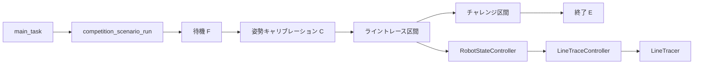
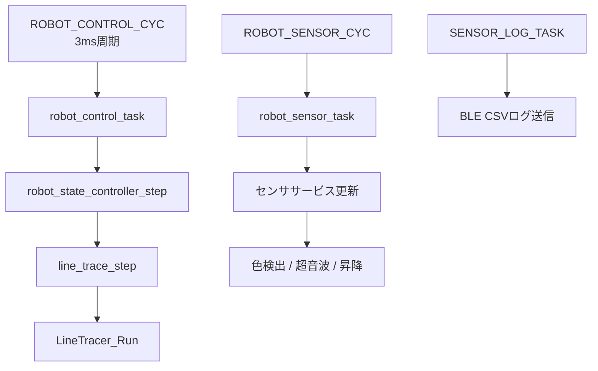
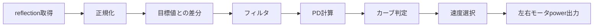
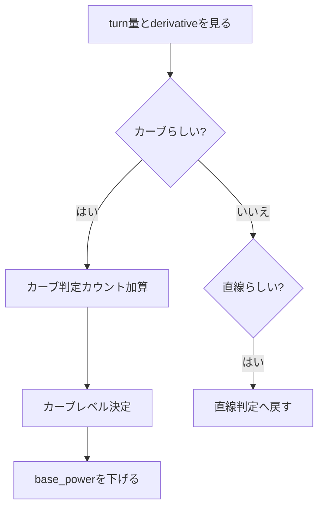
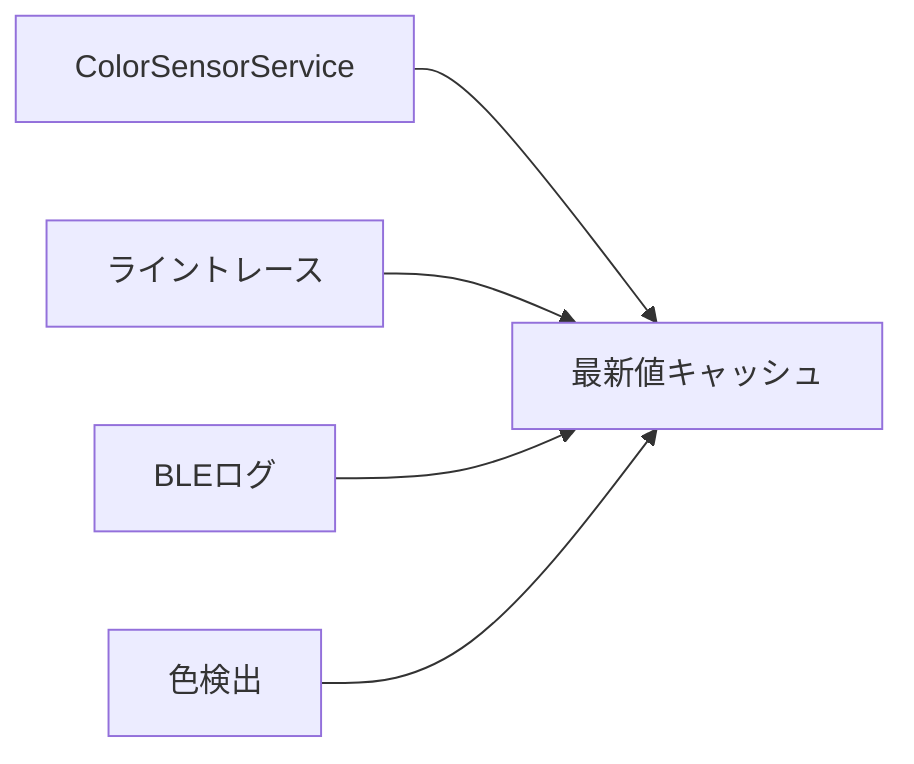
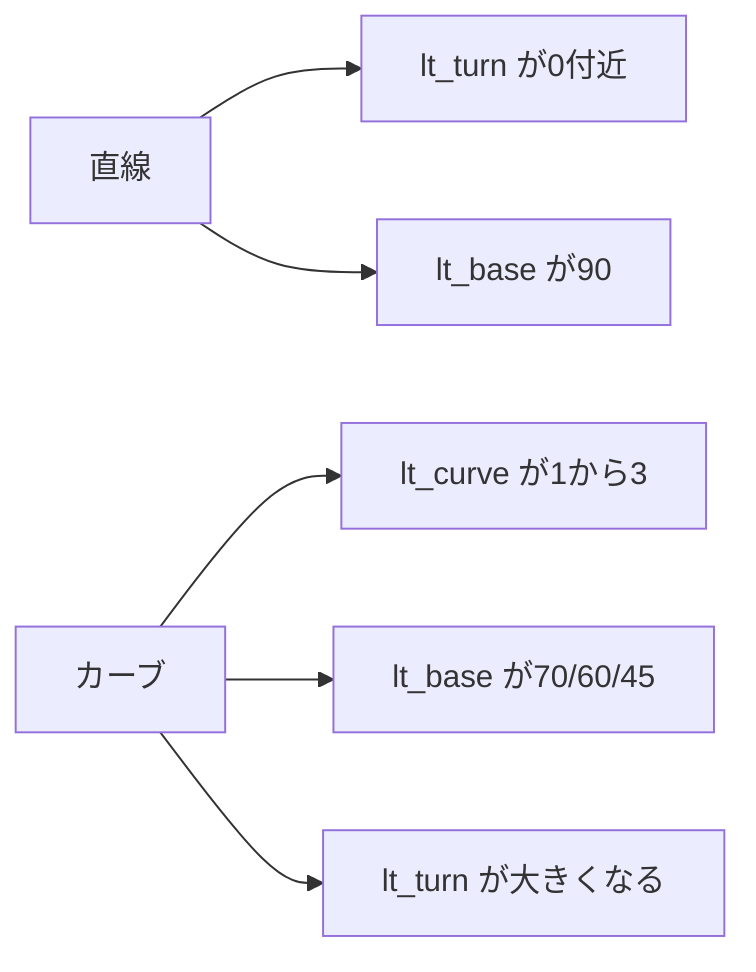
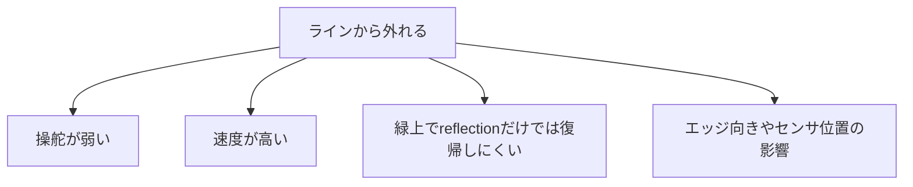

# 進捗報告

## etrobo_app_0 ライントレース改善

対象期間: 8月5日以降  
内容: ライントレース、カラーセンサ、BLEログ、カーブ対応の整理

---

# 出席率

- 全体ミーティング: ??%
- 班ミーティング: ??%

## 補足

出席率の具体値は、ミーティング記録または出欠表から確認して記入する。

---

# スケジュール

## 短期的な予定

- [ ] 次回走行までに、左カーブで `lt_turn` が十分に出ているか確認する
- [ ] 次回走行までに、カーブ中に `lt_base=60` または `45` が出ているか確認する
- [ ] 次回走行までに、直線でのふらつき原因がライン制御かIMU補正かをログで切り分ける

---

# スケジュール

## 長期的な予定

- 来月までに、ライントレースを安定して完走できる状態にする
- 来月までに、カラーセンサ、超音波センサ、センサ昇降を並列処理で安全に動かす
- 今季までに、ログを使って調整できる走行プログラムにする
- 今季までに、ボトル検出やチャレンジ区間とライントレースをつなげる

---

# 前回の議論

## 前回決まったこと

- `etrobo_app_0` を中心に作業する
- ライントレースは `sample_cpp5` の考え方に寄せる
- ただし最終的には `etrobo_app_0` の構成に統合する
- カラーセンサの読み取り競合を起こさないようにする
- ライントレース中は基本的に reflection を使う
- BLEログで走行状態を確認できるようにする

---

# 前回の議論

## 問題として出ていたこと

- 直線でふらつきが多い
- 左カーブで曲がり切れない
- ラインから左側へ外れていく
- カラーセンサの周期や読み取り方法が分かりにくい
- PD制御の計算式や定数の場所が分かりにくい
- BLE接続後にログや動作が安定しているか確認したい

---

# 進捗報告

## 全体構成を整理



## 内容

走行シナリオ、状態管理、ライントレース本体を分けて整理した。

---

# 進捗報告

## タスク構成を整理



## 内容

ライントレース制御、センサ更新、ログ送信を別タスクで扱う形にした。

---

# 進捗報告

## ライントレースをPD制御に変更



```text
error = target - normalized_reflection
derivative = (error - previous_error) / 0.003
turn = KP * error + KD * derivative
left_power  = base_power + turn
right_power = base_power - turn
```

---

# 進捗報告

## 現在のPD制御設定

| 状態 | KP | KD | 目的 |
|---|---:|---:|---|
| 直線 | 0.28 | 0.001 | ふらつきを抑える |
| カーブ | 0.38 | 0.001 | 曲がり遅れを減らす |

| 項目 | 値 |
|---|---:|
| 制御周期 | 3ms |
| 誤差フィルタ | 0.30 |
| 誤差デッドバンド | 3.0 |
| 左エッジ設定 | -1 |

---

# 進捗報告

## カーブ検出と減速を追加



| 走行状態 | base_power |
|---|---:|
| 直線 | 90 |
| ゆるいカーブ | 70 |
| 普通カーブ | 60 |
| きついカーブ | 45 |

---

# 進捗報告

## カラーセンサ読み取りを一元化



## 内容

- カラーセンサの直接読み取りを減らした
- ライントレース中は reflection を中心に使う
- ログや色検出は同じ最新値を見る形にした
- 読み取り競合を避けるためにセマフォで保護した

---

# 進捗報告

## BLEログを追加

| 項目 | 意味 |
|---|---|
| `lt_ref` | ライントレース中の生reflection |
| `lt_nref` | 正規化reflection |
| `lt_err` | 制御用誤差 |
| `lt_der` | 誤差の変化量 |
| `lt_base` | 選ばれた基準power |
| `lt_line` | ラインだけの補正 |
| `lt_imu` | 直線中のIMU補正 |
| `lt_turn` | 最終操舵power |
| `lt_curve` | カーブ判定レベル |

---

# 進捗報告

## ログで確認する内容



## 見たい状態

- 直線では左右power差が小さい
- カーブでは `lt_curve` が立つ
- 急カーブでは `lt_base=45` が出る

---

# 進捗報告

## 現在の実機課題

動画とログから、次の問題が残っている。

- 開始直後はラインを追えている
- しばらくすると左側へ外れていく
- 左カーブで曲がり遅れがある
- カーブ判定は出ているが、減速と操舵がまだ足りない可能性がある



---

# 進路関係

## 現時点で記入すること

- 進路に関する活動状況を記入する
- 説明会、面談、提出物、試験日程などを記入する
- ETロボコン活動との日程調整が必要ならここに書く

## 例

- ?/? 進路面談
- ?/? 提出物締切
- ?/? 説明会参加

---

# 余談

## 試走で分かったこと

- ビルドだけでは分からない問題が、実機走行でかなり見える
- BLEログがあると、感覚ではなく数値で原因を見られる
- reflectionだけだと処理は軽いが、緑に乗った後の復帰は難しくなる可能性がある

## 次回に向けて

次の走行では、動画とBLEログを同時に見て、  
左カーブで必要な操舵量と減速量を決める。

---

# まとめ

8月5日以降は、ライントレースを単体で直すのではなく、  
**制御周期、カラーセンサ読み取り、BLEログ、カーブ減速まで含めて整理** した。

現在はビルド可能な状態。  
次は実走ログを使って、直線のふらつきと左カーブの曲がり遅れを調整する。

